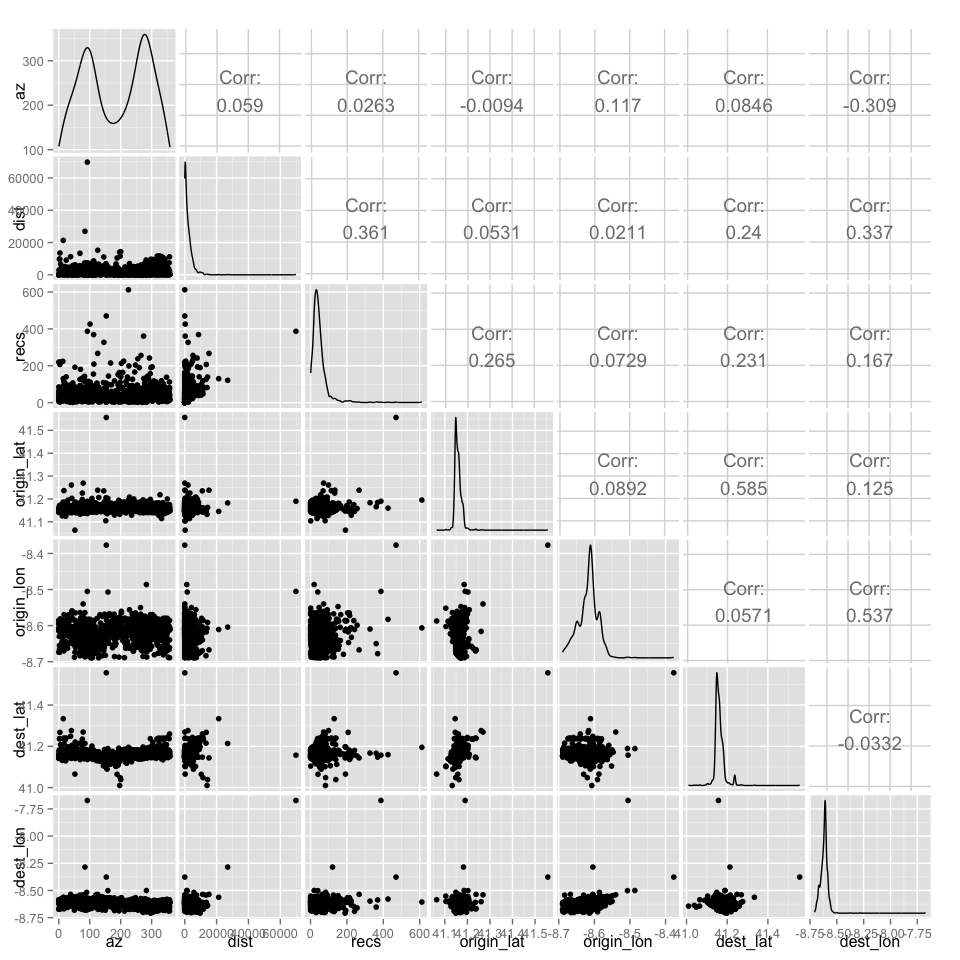
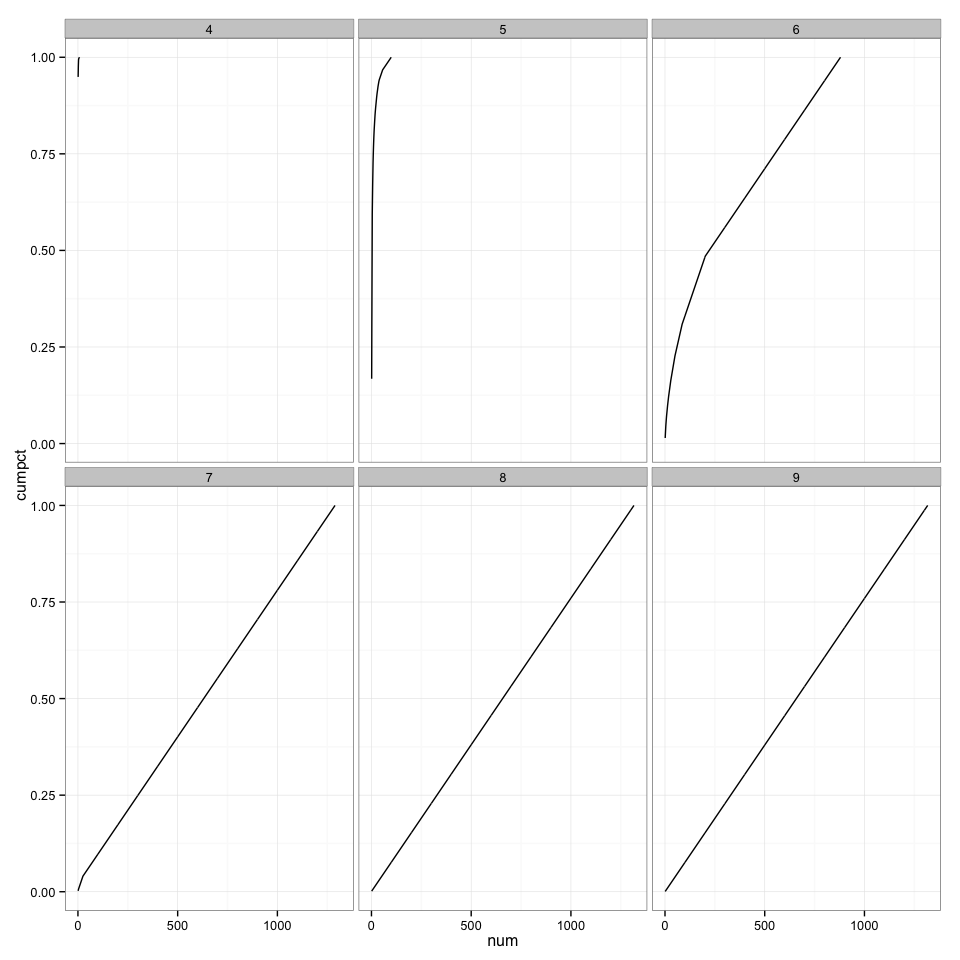
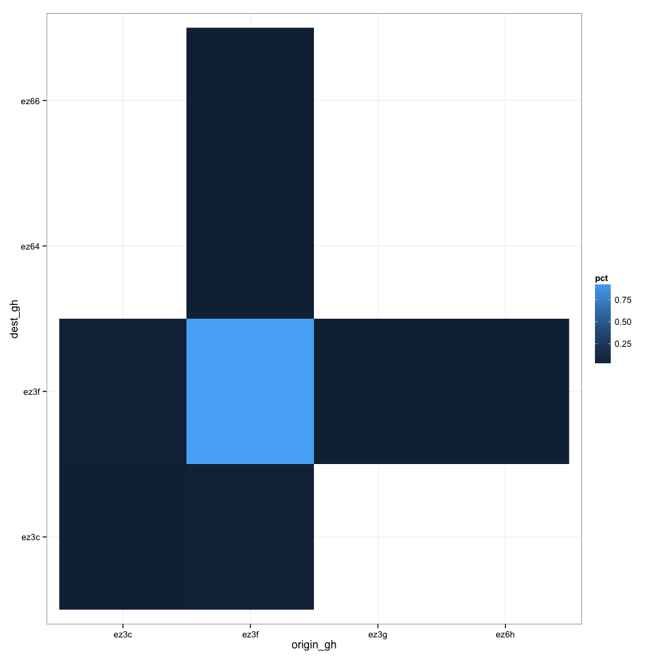
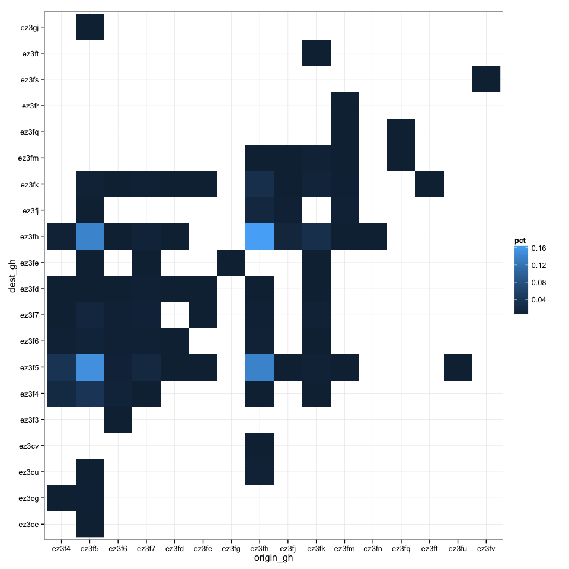
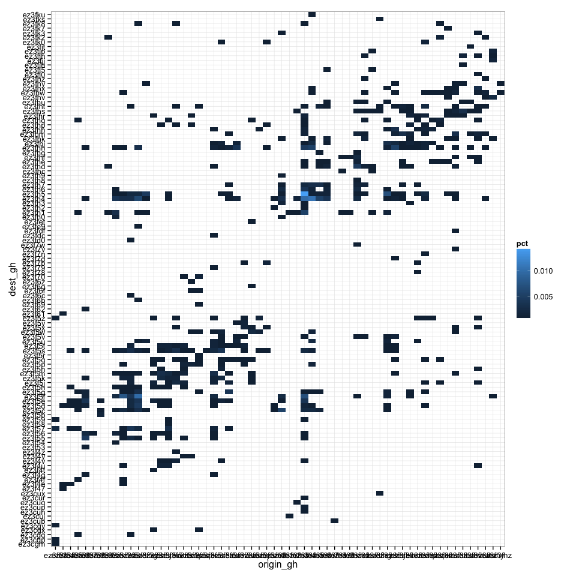
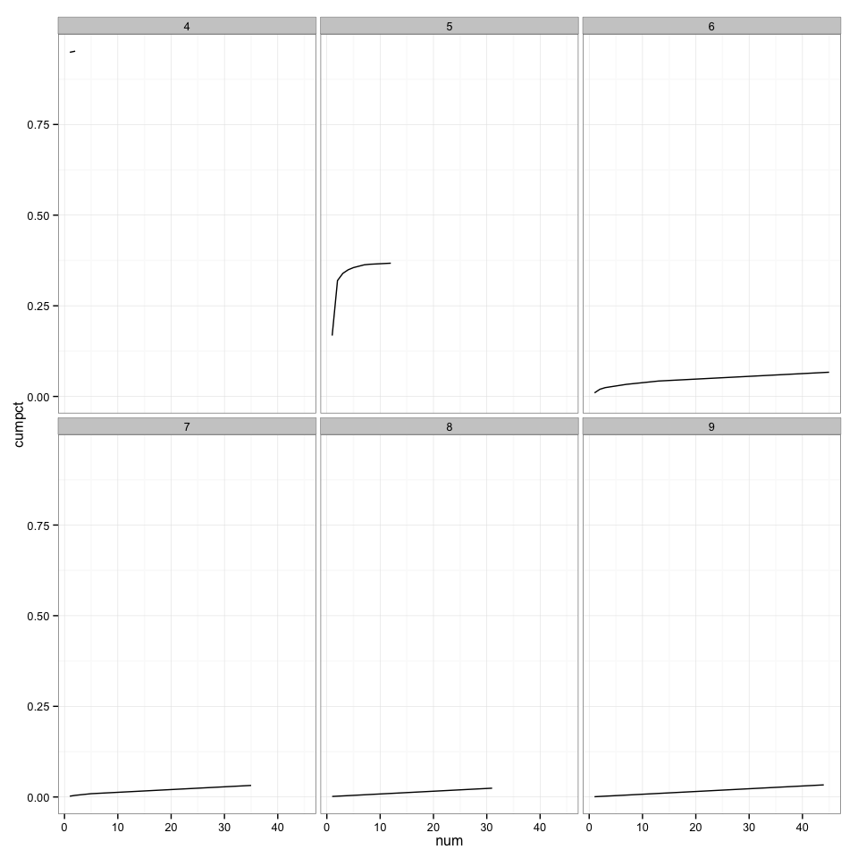

# Map Analysis
Brad Dixon <rbdixon@gmail.com>  
May 12, 2015  


# Porto, Portugal


```r
map=leaflet() %>% 
  addTiles(options = tileOptions(opacity=0.4)) %>% 
  setView(-8.621953, 41.162142, 12)
map
```

<!--html_preserve--><div id="htmlwidget-6298" style="width:960px;height:960px;" class="leaflet"></div>
<script type="application/json" data-for="htmlwidget-6298">{ "x": {
 "calls": [
 {
 "method": "addTiles",
"args": [
 "http://{s}.tile.openstreetmap.org/{z}/{x}/{y}.png",
null,
{
 "minZoom":                 0,
"maxZoom":                18,
"maxNativeZoom": null,
"tileSize":               256,
"subdomains": "abc",
"errorTileUrl": "",
"tms": false,
"continuousWorld": false,
"noWrap": false,
"zoomOffset":                 0,
"zoomReverse": false,
"opacity":               0.4,
"zIndex": null,
"unloadInvisibleTiles": null,
"updateWhenIdle": null,
"detectRetina": false,
"reuseTiles": false,
"attribution": "&copy; <a href=\"http://openstreetmap.org\">OpenStreetMap</a> contributors, <a href=\"http://creativecommons.org/licenses/by-sa/2.0/\">CC-BY-SA</a>" 
} 
] 
} 
],
"setView": [
 [         41.162142,         -8.621953 ],
               12,
[] 
] 
},"evals": [  ] }</script><!--/html_preserve-->

# Trip Variables


```r
FULL_TRIP_DETAILS = TRIP_DETAILS %>% 
  # filter(level==9) %>% 
  left_join(GHINFO, by=c(origin_gh="gh")) %>% 
  rename(level=level.x, origin_centroid=centroid, origin_lat=lat, origin_lon=lon, origin_geo=geo, origin_geojson=geojson) %>% 
  select(-level.y, -gh) %>% 
  left_join(GHINFO, by=c(dest_gh="gh")) %>% 
  select(-level.y, -gh) %>% 
  rename(level=level.x, dest_centroid=centroid, dest_lat=lat, dest_lon=lon, dest_geo=geo, dest_geojson=geojson) %>% 
  compute

FULL_TRIP_DETAILS %>% 
  filter(level==9) %>% 
  select(az, dist, recs, origin_lat, origin_lon, dest_lat, dest_lon) %>% 
  collect %>% 
  ggpairs()
```

 

# Lat/Lon Scatterplot


```r
ORIGIN=FULL_TRIP_DETAILS %>%
  filter(level==9) %>% 
  group_by(origin_gh) %>% 
  summarize(
    n = n(),
    lat=mean(origin_lat),
    lon=mean(origin_lon),
    dist = mean(dist)
  ) %>% 
  collect

DESTINATION=FULL_TRIP_DETAILS %>%
  filter(level==9) %>% 
  group_by(dest_gh) %>% 
  summarize(
    n = n(),
    lat=mean(dest_lat),
    lon=mean(dest_lon),
    dist = mean(dist)
  ) %>% 
  collect

map %>% 
  addCircles(ORIGIN$lon, ORIGIN$lat, color="green") %>% 
  addCircles(DESTINATION$lon, DESTINATION$lat, color="blue")
```

<!--html_preserve--><div id="htmlwidget-2232" style="width:960px;height:960px;" class="leaflet"></div>
<script type="application/json" data-for="htmlwidget-2232">{ "x": {
 "calls": [
 {
 "method": "addTiles",
"args": [
 "http://{s}.tile.openstreetmap.org/{z}/{x}/{y}.png",
null,
{
 "minZoom":                 0,
"maxZoom":                18,
"maxNativeZoom": null,
"tileSize":               256,
"subdomains": "abc",
"errorTileUrl": "",
"tms": false,
"continuousWorld": false,
"noWrap": false,
"zoomOffset":                 0,
"zoomReverse": false,
"opacity":               0.4,
"zIndex": null,
"unloadInvisibleTiles": null,
"updateWhenIdle": null,
"detectRetina": false,
"reuseTiles": false,
"attribution": "&copy; <a href=\"http://openstreetmap.org\">OpenStreetMap</a> contributors, <a href=\"http://creativecommons.org/licenses/by-sa/2.0/\">CC-BY-SA</a>" 
} 
] 
},
{
 "method": "addCircles",
"args": [
 [  41.1469101905823,  41.1650204658508,  41.1573386192322,  41.1644625663757,  41.1472535133362,  41.1455368995667,  41.1620593070984,  41.1615014076233,  41.1584973335266,  41.1719298362732,  41.1649346351624,  41.1757063865662,  41.1476826667786,  41.1408162117004,  41.1581969261169,  41.1756205558777,  41.1485838890076,  41.1484122276306,  41.1479830741882,  41.1477255821228,  41.1550641059875,  41.1660933494568,  41.1539053916931,  41.1518454551697,  41.1489701271057,  41.1480259895325,  41.1531758308411,  41.1630034446716,   41.147940158844,  41.1545062065125,  41.1757493019104,  41.1657500267029,  41.1778092384338,  41.1463952064514,  41.1459231376648,  41.1492276191711,   41.147940158844,  41.1457085609436,  41.1693549156189,  41.1580681800842,  41.1512875556946,  41.1535620689392,  41.1827874183655,   41.163432598114,  41.1417603492737,  41.1556649208069,  41.1424040794373,   41.138927936554,  41.1458802223206,  41.1809420585632,  41.1559224128723,  41.1593127250671,  41.1662220954895,  41.1476397514343,   41.163432598114,  41.1656212806702,  41.1594414710999,  41.1576390266418,  41.1796116828918,  41.1960482597351,  41.1699986457825,  41.1542057991028,  41.1908555030823,  41.1802983283997,   41.152617931366,   41.154248714447,  41.1576390266418,  41.1538624763489,  41.2385773658752,  41.1771655082703,  41.1606001853943,  41.1554074287415,  41.1492276191711,  41.1463093757629,  41.1446356773376,  41.1536478996277,  41.1615872383118,  41.1496567726135,  41.1687541007996,  41.1811995506287,   41.162703037262,  41.1614584922791,  41.1543774604797,  41.1406874656677,  41.1610722541809,  41.1538624763489,  41.1478972434998,  41.1773800849915,  41.1478114128113,  41.1601281166077,  41.1481976509094,  41.1610722541809,  41.1678957939148,  41.1811566352844,  41.1575531959534,  41.1674666404724,  41.1655354499817,  41.1459231376648,  41.1603856086731,  41.1410737037659,  41.1615872383118,  41.1479830741882,  41.1627888679504,  41.1439490318298,  41.1660504341125,  41.1724448204041,  41.1504292488098,  41.1542916297913,  41.1696553230286,  41.1472105979919,  41.1531329154968,  41.1632609367371,  41.1563515663147,   41.145236492157,  41.1493134498596,  41.1624026298523,   41.144163608551,  41.1540770530701,  41.1457085609436,  41.1617159843445,  41.1737751960754,  41.1414170265198,  41.1474251747131,  41.1614155769348,  41.2691330909729,  41.1412453651428,  41.1767363548279,  41.1454510688782,  41.1592698097229,  41.1667370796204,    41.15802526474,  41.1499571800232,   41.174590587616,  41.1476397514343,  41.1619734764099,  41.1660933494568,  41.1406445503235,  41.1660075187683,  41.1704277992249,   41.154420375824,  41.1636900901794,  41.1467814445496,  41.1805558204651,   41.147940158844,  41.1552786827087,  41.1536908149719,   41.145966053009,  41.1712002754211,  41.1754488945007,  41.1829161643982,  41.1803412437439,  41.1662650108337,  41.1613297462463,   41.147038936615,  41.1538195610046,  41.1530041694641,  41.1505579948425,  41.1651062965393,  41.1532616615295,   41.160900592804,  41.1654496192932,  41.1427903175354,  41.1793971061707,  41.1793112754822,  41.1476826667786,  41.1795258522034,  41.1041235923767,  41.1824870109558,   41.159827709198,  41.1420607566833,  41.1457514762878,  41.1514592170715,  41.1500000953674,  41.1472964286804,  41.1480689048767,  41.1531329154968,  41.1867356300354,  41.1492276191711,  41.1264395713806,  41.1639046669006,    41.16703748703,   41.182701587677,  41.1480259895325,  41.1343789100647,  41.1654925346375,  41.1538195610046,  41.1481976509094,  41.1472964286804,  41.1661791801453,   41.148669719696,  41.1622309684753,  41.1770796775818,  41.1457514762878,  41.1630892753601,  41.1493134498596,  41.1498713493347,  41.1492276191711,  41.1507296562195,  41.1484551429749,  41.1545062065125,   41.167209148407,  41.1500859260559,  41.1484551429749,  41.1412882804871,  41.1499571800232,  41.2062621116638,  41.1458373069763,  41.1362671852112,  41.1485409736633,  41.1590552330017,  41.1672520637512,  41.1940741539001,  41.1633467674255,  41.1453652381897,  41.1474680900574,  41.1575102806091,  41.1493992805481,  41.1466956138611,  41.1544632911682,  41.1511158943176,  41.1675953865051,  41.1577248573303,  41.1804270744324,  41.1827874183655,  41.1565661430359,   41.177122592926,   41.146137714386,  41.1557078361511,  41.1728739738464,   41.148841381073,  41.1447215080261,  41.1557936668396,  41.1723160743713,  41.1494421958923,  41.1799550056458,  41.1514163017273,  41.1477255821228,  41.1381983757019,  41.1566948890686,  41.1999535560608,  41.1469531059265,  41.1561799049377,  41.1637759208679,  41.1802124977112,  41.1487555503845,  41.1721444129944,  41.1510300636292,  41.1563515663147,  41.1593985557556,  41.1727452278137,  41.1564803123474,  41.1826586723328,   41.174418926239,  41.1495280265808,  41.1487555503845,  41.1630892753601,  41.1790108680725,  41.1610722541809,  41.1459231376648,  41.1696553230286,  41.1406874656677,  41.1451935768127,  41.1483263969421,   41.199996471405,  41.1478114128113,  41.1549353599548,  41.1736464500427,  41.1577677726746,  41.1781096458435,  41.1512446403503,  41.1573386192322,  41.1460947990417,  41.1633896827698,  41.1602997779846,  41.1670804023743,  41.1745476722717,  41.1821436882019,  41.1433482170105,  41.1714577674866,  41.1660075187683,  41.1648917198181,  41.1530470848083,   41.140730381012,  41.1460089683533,  41.1633896827698,  41.1612010002136,  41.1497855186462,  41.1602997779846,  41.1648488044739,  41.1632609367371,  41.1460089683533,  41.1840319633484,  41.1831736564636,  41.1505150794983,  41.1468243598938,  41.1823153495789,  41.1574244499207,  41.1448073387146,   41.167209148407,  41.1805129051208,  41.1673808097839,  41.1673378944397,  41.1615443229675,   41.152446269989,  41.1698698997498,  41.1656212806702,  41.1531329154968,  41.1356234550476,  41.1484122276306,  41.1458373069763,  41.1698269844055,  41.1620593070984,  41.1482834815979,  41.1485409736633,  41.2353587150574,  41.1798691749573,  41.1614155769348,  41.1665654182434,  41.1486268043518,  41.1445498466492,  41.1508584022522,  41.1510729789734,  41.1775946617126,  41.1472105979919,  41.1466526985168,  41.1575961112976,  41.1792254447937,  41.1609435081482,  41.1574673652649,   41.145966053009,  41.1469101905823,  41.2024855613708,  41.1606431007385,  41.1543774604797,  41.1420607566833,  41.1805987358093,  41.1446785926819,  41.1493134498596,  41.1445498466492,  41.1836886405945,   41.148841381073,  41.1817574501038,  41.1487126350403,  41.1462664604187,   41.157853603363,   41.147768497467,  41.1583256721497,  41.1597418785095,  41.1827445030212,  41.1465668678284,  41.1460518836975,  41.1494851112366,  41.1528325080872,  41.1454510688782,  41.1469101905823,  41.1412453651428,  41.1758780479431,  41.1576390266418,  41.1500000953674,   41.154420375824,  41.1672520637512,  41.1778521537781,  41.1540770530701,  41.2053179740906,  41.1444640159607,  41.1527037620544,  41.1603856086731,  41.1530900001526,  41.1275124549866,  41.1586260795593,  41.1472535133362,  41.1675095558167,  41.1574244499207,  41.1524033546448,  41.1646342277527,  41.1740326881409,  41.1480259895325,   41.159656047821,  41.1505579948425,  41.1507725715637,  41.1982369422913,  41.1627459526062,  41.1297011375427,  41.1485838890076,  41.1593985557556,   41.170642375946,  41.1546349525452,  41.1701273918152,  41.1447644233704,  41.1664795875549,  41.1895251274109,  41.1416745185852,  41.1487555503845,  41.1657071113586,  41.1536049842834,  41.1748909950256,   41.160728931427,  41.1535620689392,  41.1414170265198,  41.1756205558777,  41.1594843864441,  41.1142516136169,  41.1568665504456,  41.1724448204041,  41.1893534660339,  41.1572957038879,   41.150643825531,  41.1558365821838,  41.1510729789734,   41.182701587677,  41.1611580848694,  41.1520171165466,  41.1487126350403,   41.172788143158,  41.1455798149109,  41.1484980583191,  41.1548066139221,  41.1485409736633,   41.172788143158,  41.1626601219177,  41.1664795875549,  41.1591839790344,  41.1728310585022,   41.154248714447,  41.1617588996887,  41.1493563652039,   41.149914264679,  41.1679816246033,  41.1475110054016,  41.1563944816589,  41.1415457725525,  41.1494851112366,  41.1644196510315,   41.154420375824,  41.1481547355652,   41.152446269989,  41.1543345451355,   41.185576915741,  41.1481118202209,   41.159999370575,   41.162531375885,  41.1460518836975,  41.1542916297913,  41.1648058891296,  41.1573386192322,  41.1754488945007,  41.1468243598938,  41.1559653282166,  41.1468243598938,  41.1848902702332,  41.1794400215149,  41.1569952964783,  41.1603856086731,  41.1457085609436,  41.1657500267029,  41.1430907249451,  41.1721444129944,  41.1048531532288,  41.1612868309021,   41.174418926239,  41.1459231376648,  41.1410737037659,  41.1582827568054,  41.1531329154968,  41.1479830741882,  41.1672520637512,  41.1621022224426,  41.1574673652649,   41.148841381073,  41.1457514762878,  41.1482834815979,  41.1617588996887,  41.1380696296692,  41.1446356773376,   41.174418926239,  41.1523175239563,  41.1549782752991,  41.1827874183655,  41.1549782752991,  41.1728310585022,  41.1609435081482,  41.1817145347595,  41.1455368995667,  41.1473822593689,   41.165406703949,  41.1478972434998,  41.1611151695251,  41.1531329154968,  41.1612010002136,  41.1511158943176,  41.1415457725525,  41.1478543281555,  41.1746335029602,  41.1436486244202,  41.1439061164856,  41.1557078361511,  41.1602997779846,  41.1478114128113,  41.1578965187073,  41.1617588996887,  41.1550211906433,   41.170642375946,  41.1445927619934,   41.556408405304,  41.1555790901184,  41.1567807197571,  41.1597847938538,  41.1805129051208,  41.1399149894714,  41.1483693122864,   41.172788143158,  41.1526608467102,  41.1609864234924,  41.1446356773376,  41.1611151695251,   41.160900592804,  41.1568236351013,  41.1785387992859,  41.1455798149109,  41.1633896827698,  41.1509871482849,  41.1736035346985,  41.1530900001526,   41.149914264679,  41.1552786827087,   41.182701587677,  41.1642479896545,  41.1424469947815,  41.1485409736633,  41.1672520637512,  41.1644625663757,  41.1503005027771,  41.1577248573303,  41.1584973335266,  41.1332201957703,  41.1742472648621,  41.1547207832336,  41.1493134498596,  41.1501717567444,  41.1549782752991,  41.1668229103088,  41.1491417884827,  41.1637330055237,  41.1595702171326,  41.1455798149109,  41.1439061164856,  41.1551070213318,   41.180727481842,  41.1733460426331,  41.1498284339905,  41.1460089683533,  41.1731314659119,  41.1615443229675,  41.1640334129333,  41.1614155769348,  41.1484980583191,  41.1646342277527,  41.1642479896545,  41.1593127250671,  41.1730456352234,  41.1629605293274,  41.1564803123474,  41.1738610267639,   41.163604259491,  41.1623167991638,  41.1796545982361,  41.1668229103088,  41.1457943916321,  41.1522316932678,   41.157124042511,  41.1406874656677,  41.1672949790955,  41.1502575874329,  41.1546349525452,  41.1747193336487,  41.1507725715637,  41.1483693122864,  41.1506009101868,  41.1741614341736,  41.1572957038879,  41.1803412437439,  41.1516308784485,  41.1702561378479,  41.1536049842834,  41.1473393440247,  41.1604714393616,  41.1633896827698,  41.1485838890076,  41.1587977409363,  41.1455368995667,  41.1486268043518,  41.1542916297913,  41.1500000953674,  41.2183213233948,  41.1673808097839,   41.147768497467,  41.1503005027771,  41.1597418785095,  41.1745047569275,   41.145966053009,  41.1481976509094,   41.157853603363,  41.1619305610657,  41.1675953865051,  41.1556220054626,  41.1548066139221,  41.1406445503235,  41.1485409736633,  41.1495280265808,  41.1778521537781,  41.1577677726746,  41.1481118202209,  41.1291432380676,  41.1827445030212,  41.1487555503845,  41.1588835716248,  41.1456656455994,  41.1606860160828,  41.1768221855164,  41.1625742912292,   41.149570941925,   41.160900592804,  41.1473393440247,  41.1879801750183,  41.1727023124695,  41.1507725715637,  41.1475539207458,  41.1586689949036,  41.1454510688782,  41.1627888679504,  41.1626601219177,   41.155149936676,  41.1663937568665,  41.1722731590271,  41.1290574073792,  41.1467814445496,  41.1463093757629,  41.1863923072815,  41.1556649208069,  41.1500000953674,  41.1547207832336,   41.147940158844,  41.1524891853333,  41.1408162117004,  41.1612010002136,  41.1701273918152,  41.1590981483459,  41.1563944816589,  41.1689686775208,  41.1451935768127,  41.1614155769348,  41.1519742012024,  41.1675953865051,  41.1609435081482,  41.1593127250671,  41.1600852012634,  41.1838603019714,  41.1751055717468,   41.154420375824,  41.1542916297913,  41.1503434181213,  41.1486268043518,  41.1592268943787,  41.1490988731384,  41.1753630638123,  41.1588406562805,  41.1650633811951,  41.1507725715637,  41.1417603492737,   41.159656047821,  41.1641192436218,  41.1461806297302,   41.159656047821,  41.1727452278137,  41.1538195610046,  41.1707282066345,  41.1482834815979,  41.1479830741882,  41.1629176139832,    41.15154504776,  41.1547207832336,  41.1666941642761,  41.1620593070984,  41.1411166191101,   41.157853603363,  41.1707282066345,  41.1517596244812,  41.1445498466492,   41.157124042511,  41.1542916297913,  41.1787104606628,  41.1483693122864,  41.1533045768738,  41.1563515663147,  41.1709427833557,   41.146137714386,  41.1578965187073,  41.1505150794983,  41.1564803123474,  41.1477255821228,  41.1626172065735,    41.06365442276,  41.1534333229065,  41.1498713493347,  41.1496138572693,  41.1768651008606,  41.1620163917542,  41.1434769630432,  41.1245942115784,   41.167209148407,  41.1541628837585,  41.1521029472351,  41.1522316932678,  41.1516737937927,  41.1563086509705,  41.1455368995667,  41.1642479896545,  41.1482834815979,  41.1406874656677,  41.1476826667786,  41.1567378044128,  41.1411595344543,  41.1439061164856,  41.1632180213928,  41.1693978309631,  41.1481976509094,  41.1512446403503,  41.1475968360901,  41.1542057991028,  41.1644196510315,  41.1696982383728,  41.1476397514343,  41.1487555503845,  41.1461806297302,  41.1593556404114,  41.1472964286804,  41.1618876457214,  41.1597847938538,  41.1617588996887,  41.1782383918762,  41.1442065238953,  41.1712431907654,  41.1661791801453,  41.1480259895325,  41.1457514762878,  41.1525321006775,  41.1577248573303,  41.1703419685364,  41.1609864234924,  41.1510729789734,  41.1770367622375,  41.1540770530701,   41.151716709137,  41.1536908149719,    41.16055727005,  41.1484122276306,  41.1478114128113,  41.1493992805481,  41.1614155769348,  41.1507296562195,  41.1530900001526,  41.1548924446106,  41.1538624763489,  41.1547207832336,  41.1541628837585,  41.1604714393616,  41.1554932594299,  41.1446356773376,   41.182701587677,  41.1412882804871,  41.1516308784485,  41.1412024497986,  41.1681532859802,  41.1371254920959,  41.1486268043518,  41.1412024497986,  41.1552357673645,  41.1487984657288,  41.1671233177185,  41.1820578575134,  41.1483263969421,  41.1633896827698,  41.1480259895325,  41.1545491218567,  41.1726593971252,  41.1457514762878,  41.1505579948425,  41.1500000953674,  41.1727452278137,  41.1512446403503,  41.1725306510925,  41.1560940742493,  41.1565232276917,  41.1491417884827,  41.1557078361511,   41.148841381073,  41.1472535133362,  41.1523604393005,  41.1746335029602,  41.1594843864441,  41.1489701271057,  41.1589694023132,  41.1609864234924,  41.1409878730774,  41.1597418785095,  41.1481547355652,  41.1825728416443,  41.1666941642761,  41.1494851112366,  41.1577677726746,  41.1472535133362,  41.1730456352234,  41.1574244499207,  41.1495280265808,  41.1494851112366,  41.1538195610046,   41.152446269989,  41.1543345451355,  41.1548066139221,  41.1705565452576,  41.1675953865051,  41.1527466773987,  41.1665225028992,  41.1485409736633,  41.1618876457214,  41.1827445030212,   41.185576915741,  41.1475968360901,  41.1564373970032,   41.190083026886,    41.14901304245,  41.1438202857971,  41.1669945716858,  41.1545920372009,   41.157853603363,  41.1427474021912,  41.1463952064514,  41.1525321006775,  41.1536908149719,   41.168839931488,  41.1487126350403,  41.1615014076233,  41.1797404289246,  41.1293148994446,   41.167938709259,  41.1538624763489,  41.1557078361511,  41.1491847038269,  41.1573815345764,  41.1709427833557,  41.1542916297913,  41.1457514762878,  41.1626601219177,  41.1575531959534,  41.1639046669006,   41.162531375885,  41.1595702171326,  41.1409449577332,  41.1793541908264,  41.1717581748962,  41.1433911323547,  41.1977219581604,  41.1438202857971,   41.152446269989,  41.1746764183044,  41.1597847938538,  41.1806416511536,   41.152617931366,  41.1460089683533,    41.15154504776,   41.156051158905,  41.1661791801453,  41.1769080162048,  41.1453652381897,  41.1621880531311,   41.145966053009,  41.1573386192322,  41.1582827568054,   41.159827709198,  41.1630463600159,  41.1475968360901,  41.1800408363342,  41.1466526985168,  41.1552357673645,  41.1512017250061,  41.1659646034241,  41.1557507514954,  41.1612010002136,  41.1462235450745,  41.1461806297302,  41.1843752861023,  41.1525750160217,  41.1431765556335,  41.1649346351624,  41.1564803123474,    41.17999792099,  41.1461806297302,  41.1502575874329,  41.1757063865662,  41.1948037147522,  41.1575102806091,  41.1676383018494,  41.1458373069763,  41.1456227302551,  41.1611151695251,  41.1520600318909,  41.1479830741882,  41.1443781852722,  41.1685824394226,  41.1497855186462,  41.1669087409973,  41.1693120002747,  41.1641192436218,  41.1503863334656,  41.1630892753601,  41.1472535133362,  41.1736035346985,  41.1629176139832,  41.1501717567444,   41.148669719696,  41.1596989631653,  41.1471676826477,  41.1793112754822,  41.1826157569885,  41.1521887779236,  41.1454939842224,  41.1574673652649,  41.1787104606628,  41.1707711219788,  41.1689257621765,  41.1463952064514,  41.1454939842224,  41.1491847038269,  41.2382769584656,  41.1480259895325,  41.1469960212708,  41.1644625663757,   41.163604259491,  41.1819291114807,   41.147940158844,   41.146137714386,  41.1669087409973,  41.1610722541809,  41.1660504341125,  41.1535620689392,  41.1560940742493,  41.1630463600159,  41.2081074714661,  41.1723160743713,   41.172788143158,  41.1503863334656,  41.1597418785095,  41.1557507514954,  41.1460518836975,  41.1590552330017,  41.1502146720886,  41.1566948890686,  41.1724019050598,  41.1578965187073,  41.1669945716858,  41.1408162117004,  41.1777234077454,  41.1582398414612,  41.1547636985779,  41.1622309684753,  41.1754059791565,   41.153519153595,  41.1513304710388,  41.1747193336487,  41.1780667304993,  41.1601281166077,  41.1590552330017,   41.154248714447,  41.2023138999939,  41.1814141273499,  41.1427044868469,   41.155149936676,  41.1606001853943,  41.1484551429749,  41.1626601219177,  41.1445069313049,  41.1637759208679,  41.2029147148132,  41.1515879631042,  41.1612868309021,  41.1638617515564,   41.162531375885,  41.1527895927429,   41.146137714386,  41.1692690849304,  41.1406016349792,  41.1471676826477,  41.1559224128723,  41.1599564552307,  41.1576390266418,  41.1328768730164,  41.1512875556946,  41.1540341377258,  41.1660075187683,  41.1462235450745,  41.1412453651428,  41.1549353599548,  41.1480689048767,   41.173689365387,  41.1434769630432,  41.1611580848694,  41.1519312858582,   41.155321598053,  41.1778950691223,  41.1489701271057,  41.1539483070374,  41.1472535133362,  41.1862635612488,  41.1813712120056,  41.1332201957703,   41.149570941925,  41.1411166191101,  41.1688828468323,   41.147940158844,  41.1453652381897,  41.1577248573303,  41.1643767356873,  41.1564373970032,  41.1474251747131,  41.1655354499817,  41.1512875556946,  41.1785817146301,  41.1478114128113,  41.1736035346985,  41.1638617515564,  41.1472964286804,  41.1618447303772,  41.1446356773376,  41.1695694923401,  41.1573386192322,  41.1528754234314,  41.1460089683533,  41.1432194709778,  41.1491417884827,  41.1446785926819,  41.1453223228455,  41.1491417884827,  41.1545491218567,   41.170642375946,  41.1561799049377,  41.1486268043518,  41.1630034446716,  41.1429190635681,  41.1518883705139,  41.1534333229065,  41.1585831642151,  41.1474680900574,  41.1599135398865,  41.1734318733215,  41.1621880531311,  41.1481118202209,  41.1624884605408,  41.1457514762878,  41.1589694023132,  41.1763501167297,  41.1705136299133,  41.1394000053406,  41.1673808097839,  41.1575961112976,  41.1617588996887,  41.1614584922791,  41.1637759208679,  41.2608933448792,  41.1675953865051,  41.1611580848694,  41.1601281166077,  41.1614155769348,  41.1537766456604,  41.1536478996277,  41.1609435081482,  41.1781525611877,  41.1536908149719,  41.1646771430969,  41.1608576774597,  41.1533045768738,  41.1419320106506,  41.1483693122864,  41.1588406562805,  41.1860060691833,  41.1412453651428,  41.1406445503235,  41.1403870582581,   41.140730381012,  41.1548495292664,  41.1547636985779,  41.1640334129333,  41.1460947990417,  41.1484980583191,  41.2257885932922,  41.1668658256531,  41.1474680900574,  41.1552786827087,  41.1758351325989,   41.160900592804,  41.1480689048767,  41.1539053916931,  41.1545920372009,  41.1453223228455,  41.1734747886658,  41.1489272117615,  41.1503863334656,  41.1412024497986,   41.147940158844,  41.1652779579163,  41.1714577674866,  41.1751484870911,  41.1496567726135,  41.1503005027771,  41.1530470848083,  41.1597418785095,  41.1738610267639,  41.1574673652649,  41.1506867408752,  41.1692261695862,  41.1524033546448,  41.1835598945618,  41.1572957038879,  41.1811566352844,  41.1539053916931,  41.1839890480042,  41.1696982383728,  41.1460947990417,  41.1722731590271,  41.1549782752991,  41.1743760108948,  41.1472964286804,  41.1634755134583,  41.1575102806091,  41.1655354499817,  41.1585831642151,  41.1447215080261,  41.1485838890076,  41.1610293388367,  41.1525321006775,  41.1739039421082,  41.1886239051819,  41.1622309684753,  41.1551070213318,   41.161801815033,  41.1412882804871,  41.1501288414001,   41.154420375824,  41.1476826667786,  41.1826157569885,  41.1627459526062,  41.1583256721497,  41.1427044868469,  41.1414170265198,  41.1728310585022,  41.1606431007385,  41.1557078361511,  41.1632180213928,  41.1750626564026,  41.1527037620544,  41.1611580848694,  41.1635184288025,   41.162703037262,  41.1557078361511,  41.1497855186462,  41.1506867408752,  41.1785817146301,   41.128842830658,  41.1631751060486,  41.1420178413391,  41.1651492118835,  41.1637759208679,  41.1592268943787,   41.141631603241,  41.1502575874329,    41.16055727005,  41.1633038520813,  41.1705565452576,  41.1524891853333,  41.1556220054626,  41.1489272117615,  41.1615014076233,  41.1545062065125,  41.1642909049988,  41.1609435081482,  41.1542916297913,  41.1754059791565,  41.1721014976501,  41.1502146720886,  41.1498284339905,  41.1512446403503,  41.1494851112366,  41.1660504341125,  41.1645483970642,  41.1471676826477,  41.1447215080261,  41.1683249473572,   41.147940158844,  41.1572098731995,  41.1637759208679,  41.1503005027771,   41.178195476532,  41.1496996879578,  41.1725735664368,  41.1476397514343,   41.155149936676,  41.1524891853333,  41.1478543281555,  41.1485409736633,  41.1445069313049,   41.159827709198,  41.1507725715637,  41.1484980583191,  41.1631321907043,  41.1605143547058,  41.1865639686584,  41.1481118202209,  41.1434769630432,  41.1593985557556,  41.1532187461853,  41.1635613441467,  41.1595273017883,  41.1552357673645,  41.1415028572083,  41.1826586723328,  41.1685395240784,  41.1763501167297,  41.1491417884827,   41.165406703949,  41.1576819419861,  41.1673808097839,  41.1739039421082,  41.1463093757629,  41.2365174293518,  41.1460089683533,  41.1480259895325,  41.1413741111755,  41.1621880531311,  41.1633467674255,  41.1408162117004,  41.1798691749573,  41.1495280265808,  41.1492705345154,  41.1471247673035,  41.1476826667786,  41.1668658256531,  41.1953186988831,  41.1609864234924,  41.1424899101257,   41.169912815094,  41.1447644233704,  41.1525750160217,  41.1489701271057,  41.1549353599548,  41.1485838890076,  41.1521029472351,  41.1529183387756,  41.1757063865662 ],
[ -8.620040416717529, -8.606221675872799, -8.630082607269291,  -8.6686635017395, -8.60798120498657, -8.60729455947876, -8.63450288772583, -8.656861782073969, -8.593175411224371, -8.62643480300903, -8.628408908843991, -8.61381769180298, -8.611972332000731, -8.61544847488403, -8.60454797744751, -8.66055250167847, -8.58566522598267, -8.61390352249146, -8.611843585968019, -8.60999822616577, -8.679521083831791, -8.569700717926031, -8.674070835113531, -8.64553213119507, -8.58656644821167, -8.61986875534058, -8.670723438262939, -8.63866567611694,  -8.6197829246521, -8.613216876983641, -8.585922718048099, -8.67977857589722, -8.624589443206791, -8.61407518386841,  -8.6142897605896, -8.599312305450439, -8.61424684524536, -8.610813617706301, -8.60566377639771, -8.60888242721558, -8.60956907272339, -8.610298633575439, -8.60021352767944, -8.61703634262085, -8.61553430557251, -8.65239858627319, -8.620126247406009, -8.609611988067631, -8.598668575286871, -8.66505861282349, -8.60248804092407, -8.580086231231689, -8.615791797637939, -8.60883951187134, -8.625662326812741, -8.58875513076782, -8.68385553359985, -8.628151416778559, -8.60287427902222, -8.68544340133667, -8.64574670791626, -8.595278263092039, -8.58253240585327, -8.581888675689701, -8.631284236907961, -8.64917993545532, -8.61248731613159, -8.67419958114624, -8.667290210723881, -8.681967258453369, -8.607680797576901,  -8.6206841468811, -8.599183559417719, -8.610169887542719, -8.606479167938231, -8.64089727401733, -8.650381565093991, -8.673727512359619, -8.611843585968019, -8.62922430038452, -8.591201305389401, -8.60059976577759, -8.649222850799561, -8.61553430557251, -8.604118824005131, -8.611972332000731, -8.61986875534058, -8.657333850860599, -8.60853910446167, -8.63579034805298, -8.62411737442017, -8.62085580825806, -8.643171787261959, -8.583176136016849, -8.62776517868042, -8.64973783493042, -8.575966358184809, -8.61257314682007, -8.65978002548218, -8.61381769180298, -8.64025354385376, -8.619911670684809, -8.64965200424194, -8.57442140579224, -8.56974363327026, -8.68085145950317, -8.66214036941528, -8.64943742752075, -8.658750057220461, -8.617379665374759, -8.64686250686646, -8.676087856292719, -8.609354496002201, -8.57991456985474, -8.58789682388306, -8.649351596832281, -8.61244440078735, -8.63055467605591, -8.606865406036381, -8.56716871261597, -8.655359745025629, -8.61343145370483, -8.62107038497925, -8.656904697418209,  -8.5399603843689, -8.61407518386841, -8.625447750091549, -8.610899448394781, -8.636605739593509, -8.60167264938354, -8.60270261764526, -8.664243221282961, -8.688962459564211, -8.608925342559809, -8.587682247161871, -8.57043027877808, -8.615748882293699, -8.64999532699585, -8.650810718536381, -8.64939451217651, -8.66437196731567, -8.61111402511597, -8.58240365982056, -8.61115694046021, -8.595278263092039, -8.62870931625366, -8.613646030426031, -8.54717016220093, -8.599870204925541, -8.624503612518311, -8.634116649627691, -8.685872554779049, -8.60008478164673, -8.606908321380621, -8.650295734405519, -8.668148517608641, -8.610298633575439, -8.63059759140015, -8.644716739654539, -8.646304607391359, -8.604934215545651, -8.574721813201901, -8.585751056671141, -8.60562086105347, -8.60999822616577, -8.624331951141359, -8.551676273345951, -8.596909046173099, -8.639824390411381, -8.61961126327515, -8.61111402511597, -8.60948324203491,  -8.6177659034729, -8.60828161239624, -8.610641956329349, -8.63055467605591, -8.56467962265015, -8.610427379608151, -8.598196506500241, -8.629395961761469, -8.627121448516849, -8.60021352767944, -8.61274480819702, -8.64411592483521, -8.57266187667847, -8.64115476608276, -8.623945713043209, -8.615748882293699, -8.643858432769781, -8.585751056671141, -8.649866580963129, -8.68209600448608, -8.610856533050541, -8.67604494094849, -8.61094236373901, -8.61943960189819, -8.625576496124269, -8.67694616317749, -8.646132946014401, -8.63042593002319, -8.56734037399292, -8.60699415206909, -8.58566522598267, -8.61403226852417, -8.625748157501221, -8.636176586151119, -8.57815504074097, -8.62767934799194, -8.600685596466059, -8.643858432769781, -8.64960908889771, -8.57819795608521, -8.64948034286499, -8.57982873916626, -8.60875368118286, -8.61004114151001, -8.61115694046021, -8.61398935317993, -8.613259792327881, -8.64540338516235, -8.610513210296631, -8.632400035858151, -8.59034299850464,  -8.6003851890564, -8.57420682907104, -8.609354496002201, -8.617594242095951, -8.62107038497925, -8.60673666000366, -8.59750986099243, -8.617422580718991, -8.668105602264401, -8.56764078140259, -8.64094018936157, -8.60334634780884, -8.62913846969604, -8.58875513076782, -8.61098527908325, -8.574593067169189, -8.658792972564701, -8.586094379425051,  -8.6417555809021, -8.620641231536871, -8.68703126907349, -8.65780591964722, -8.606436252593991, -8.62107038497925, -8.621199131011959, -8.58128786087036, -8.61218690872192, -8.67995023727417, -8.60012769699097, -8.648879528045651, -8.61107110977173, -8.612143993377691, -8.590428829193121, -8.629438877105709, -8.62879514694214, -8.612358570098881, -8.596694469451901, -8.61544847488403, -8.639867305755621, -8.613045215606689, -8.567855358123779,  -8.6113715171814, -8.630640506744379, -8.640511035919189, -8.60999822616577, -8.58690977096558, -8.60948324203491, -8.62497568130493, -8.617637157440191, -8.66917848587036, -8.64304304122925, -8.588283061981199, -8.567469120025629, -8.59776735305786, -8.60519170761108, -8.60454797744751, -8.606436252593991, -8.64832162857056, -8.637893199920651, -8.61544847488403, -8.611886501312259, -8.584206104278559, -8.569614887237551, -8.60600709915161, -8.578712940216059, -8.584935665130621, -8.614161014556879, -8.61068487167358, -8.61119985580444, -8.58231782913208, -8.661110401153559, -8.609139919281009, -8.59695196151733, -8.628151416778559, -8.606479167938231, -8.593733310699459, -8.649866580963129, -8.64960908889771, -8.68548631668091, -8.65003824234009, -8.628408908843991, -8.62870931625366, -8.64561796188354, -8.670594692230219, -8.61154317855835, -8.59935522079468, -8.60699415206909, -8.62866640090942, -8.618409633636469, -8.64832162857056, -8.598067760467529, -8.669650554656981, -8.603732585906981, -8.63197088241577, -8.64115476608276, -8.585751056671141, -8.606607913970951, -8.60682249069214, -8.60124349594116, -8.66879224777222,  -8.6087965965271, -8.61497640609741,  -8.5932183265686,  -8.6252760887146, -8.62866640090942, -8.628151416778559, -8.61248731613159, -8.620254993438721, -8.50695848464966, -8.643515110015869, -8.64939451217651, -8.61437559127808, -8.58244657516479, -8.606522083282471, -8.61115694046021, -8.624374866485599, -8.66192579269409, -8.610641956329349, -8.67814779281616, -8.648879528045651, -8.617551326751711, -8.64527463912964, -8.610513210296631,  -8.6316704750061, -8.592703342437741, -8.60394716262817, -8.603818416595461, -8.61768007278442, -8.61098527908325, -8.632528781890869, -8.61094236373901, -8.61111402511597, -8.61398935317993, -8.653299808502201, -8.627250194549561, -8.60712289810181, -8.56038808822632, -8.64952325820923, -8.624546527862551, -8.62094163894653, -8.639481067657471, -8.576695919036871, -8.61549139022827, -8.60956907272339, -8.62634897232056, -8.62441778182983, -8.66377115249634, -8.616135120391849, -8.64973783493042, -8.63025426864624, -8.63510370254517, -8.639824390411381, -8.650424480438231, -8.61982583999634, -8.639867305755621, -8.66093873977661, -8.63042593002319, -8.58965635299683, -8.61098527908325, -8.581202030181879, -8.585708141326901, -8.580043315887449, -8.665831089019781, -8.649051189422609, -8.64570379257202, -8.606479167938231, -8.58364820480347, -8.580601215362551, -8.58798265457153, -8.59776735305786, -8.659608364105219, -8.607895374298099, -8.583090305328369, -8.604934215545651, -8.60720872879028, -8.613517284393311, -8.66750478744507, -8.567984104156491, -8.588197231292719, -8.611800670623779, -8.587639331817631, -8.67308378219604, -8.62806558609009, -8.647677898406981, -8.665444850921631, -8.59386205673218, -8.60012769699097, -8.604118824005131, -8.57429265975952, -8.585751056671141, -8.61253023147583, -8.61094236373901, -8.585708141326901, -8.63034009933472, -8.585708141326901, -8.61248731613159, -8.61098527908325, -8.609268665313721, -8.611972332000731, -8.67419958114624, -8.64686250686646, -8.640983104705811, -8.625619411468509, -8.606908321380621, -8.629524707794189, -8.62132787704468,  -8.6278510093689,  -8.5957932472229, -8.63081216812134, -8.63235712051392, -8.613259792327881, -8.657462596893311, -8.62900972366333, -8.64939451217651, -8.48614454269409, -8.606393337249759, -8.58248949050903, -8.59304666519165, -8.612143993377691, -8.649351596832281, -8.68681669235229, -8.628280162811279, -8.62767934799194, -8.619954586029049, -8.621456623077391, -8.609225749969481, -8.677804470062259, -8.624203205108641, -8.609268665313721, -8.60982656478882, -8.610899448394781, -8.67042303085327, -8.62089872360229, -8.591287136077881, -8.602530956268311, -8.598411083221441, -8.64883661270142, -8.61265897750854, -8.614761829376221, -8.584334850311279, -8.668105602264401, -8.61986875534058, -8.64956617355347, -8.609354496002201, -8.628323078155519, -8.584206104278559, -8.615148067474371, -8.658363819122309, -8.66497278213501, -8.62351655960083, -8.606436252593991, -8.61124277114868, -8.61012697219849, -8.63051176071167, -8.60025644302368, -8.658835887908941, -8.626949787139891,  -8.5923171043396, -8.59742403030396, -8.60291719436646, -8.608109951019291, -8.650209903717039, -8.61982583999634, -8.604118824005131, -8.67042303085327, -8.604161739349371, -8.62591981887817, -8.613259792327881, -8.60991239547729, -8.61956834793091, -8.610427379608151, -8.605062961578369, -8.62351655960083, -8.60059976577759, -8.610169887542719, -8.59884023666382, -8.603475093841549, -8.63081216812134, -8.618452548980709, -8.606522083282471, -8.37692499160767, -8.66351366043091, -8.59051465988159, -8.640468120574949, -8.58240365982056, -8.594419956207281, -8.585751056671141, -8.61222982406616, -8.62107038497925, -8.62892389297485, -8.606393337249759, -8.604762554168699, -8.59193086624146, -8.628494739532471, -8.61394643783569, -8.610899448394781, -8.66312742233276, -8.579013347625731, -8.654716014862061, -8.63849401473999, -8.60720872879028, -8.630039691925051, -8.60017061233521, -8.600943088531491, -8.602015972137449, -8.599569797515869, -8.564121723175051, -8.632185459136959, -8.60695123672485, -8.62763643264771, -8.63703489303589, -8.563821315765381, -8.584377765655519,  -8.5813307762146, -8.625490665435789, -8.62094163894653, -8.630683422088619, -8.613173961639401, -8.599226474761959, -8.633430004119869, -8.61261606216431, -8.60291719436646, -8.579957485198969, -8.63034009933472, -8.58257532119751, -8.680808544158941, -8.605921268463129, -8.61270189285278, -8.62604856491089, -8.65098237991333, -8.606393337249759, -8.65681886672974, -8.58566522598267, -8.64548921585083, -8.62321615219116, -8.57991456985474, -8.609011173248289, -8.599655628204349, -8.57030153274536, -8.68921995162964, -8.662784099578859, -8.61115694046021, -8.60287427902222, -8.65244150161743, -8.60720872879028, -8.63141298294067, -8.624203205108641, -8.61549139022827, -8.64956617355347, -8.59502077102661, -8.65518808364868, -8.57588052749634, -8.610813617706301, -8.586137294769291, -8.646605014801031, -8.58407735824585, -8.628194332122799, -8.582704067230219, -8.642055988311769, -8.56948614120483, -8.60579252243042, -8.608667850494379, -8.637893199920651, -8.58935594558716, -8.598625659942631, -8.60459089279175, -8.61544847488403, -8.58566522598267, -8.652098178863531, -8.62102746963501, -8.65772008895874, -8.64956617355347, -8.610599040985109, -8.60699415206909, -8.639566898345951, -8.648965358734131,  -8.6122727394104, -8.610770702362061, -8.62742185592651, -8.591544628143311, -8.61557722091675, -8.602530956268311, -8.67312669754028, -8.61544847488403, -8.598625659942631, -8.639352321624759, -8.568413257598881, -8.62746477127075, -8.61982583999634, -8.59785318374634,  -8.6042046546936, -8.625447750091549, -8.62926721572876, -8.60725164413452, -8.68213891983032, -8.619954586029049, -8.644974231719971, -8.61128568649292, -8.606178760528559, -8.587167263031009, -8.550002574920651, -8.61124277114868, -8.623044490814211, -8.614847660064701, -8.63171339035034, -8.607552051544189, -8.591287136077881, -8.591330051422119, -8.613002300262449, -8.64995241165161, -8.653128147125241, -8.606522083282471, -8.61107110977173, -8.601973056793209,  -8.6457896232605, -8.602530956268311, -8.66334199905396, -8.626906871795651, -8.610899448394781, -8.678319454193121, -8.61527681350708, -8.59849691390991, -8.58381986618042, -8.599612712860109, -8.572103977203369, -8.587253093719481, -8.610556125640869, -8.656861782073969, -8.62720727920532, -8.687803745269781, -8.628838062286381, -8.580043315887449, -8.64145517349243, -8.622958660125731, -8.66063833236694, -8.613302707672119, -8.649909496307369, -8.60699415206909, -8.585793972015381, -8.68359804153442, -8.586995601654049, -8.585450649261469, -8.593132495880131, -8.642184734344481, -8.602187633514401, -8.614504337310789, -8.60175848007202, -8.636391162872309, -8.61768007278442, -8.639824390411381,  -8.6122727394104, -8.674070835113531, -8.657548427581791, -8.624374866485599,  -8.6197829246521, -8.59060049057007, -8.63325834274292, -8.65518808364868, -8.68784666061401, -8.586137294769291,  -8.6142897605896, -8.62360239028931, -8.66561651229858, -8.62682104110718, -8.606522083282471, -8.61132860183716, -8.64827871322632, -8.62523317337036, -8.612916469573969, -8.60150098800659, -8.611886501312259, -8.604977130889891, -8.60707998275757, -8.668577671051031, -8.60424757003784, -8.66445779800415, -8.61098527908325, -8.657548427581791, -8.587124347686769, -8.606607913970951, -8.613002300262449, -8.673727512359619, -8.661324977874759, -8.59296083450317, -8.63978147506714, -8.62218618392944, -8.63463163375854, -8.64995241165161, -8.632571697235109, -8.652055263519291, -8.63265752792358, -8.645961284637449, -8.610813617706301, -8.589742183685299, -8.658835887908941, -8.610641956329349, -8.61403226852417, -8.67565870285034, -8.61398935317993, -8.58643770217896, -8.665745258331301, -8.652613162994379, -8.60828161239624, -8.60952615737915,  -8.6137318611145, -8.604676723480219, -8.632400035858151, -8.58922719955444,  -8.6087965965271, -8.670594692230219, -8.613646030426031, -8.580086231231689, -8.608109951019291,  -8.6527419090271, -8.63995313644409, -8.61150026321411, -8.605964183807369, -8.612143993377691, -8.626091480255131, -8.647634983062741, -8.664286136627201, -8.61094236373901, -8.62909555435181, -8.62767934799194, -8.64819288253784, -8.62879514694214, -8.634889125823969, -8.65982294082642, -8.62102746963501,  -8.6096978187561, -8.599655628204349,  -8.6443305015564, -8.64033937454224, -8.60978364944458, -8.61107110977173, -8.657290935516359, -8.59308958053589, -8.61377477645874, -8.63055467605591, -8.676130771636959, -8.673470020294189, -8.647634983062741, -8.64136934280396, -8.58909845352173, -8.606522083282471, -8.60008478164673, -8.61398935317993, -8.59999895095825, -8.61394643783569, -8.689305782318121, -8.63609075546265, -8.58562231063843, -8.61398935317993, -8.613216876983641, -8.585751056671141, -8.56463670730591, -8.59750986099243, -8.64544630050659, -8.625490665435789, -8.619911670684809, -8.61896753311157, -8.66656064987183, -8.613603115081791, -8.592574596405029, -8.62098455429077, -8.612143993377691, -8.60956907272339, -8.63321542739868, -8.61819505691528, -8.59115839004517, -8.599269390106199, -8.630125522613531, -8.58566522598267, -8.61557722091675, -8.606564998626711, -8.617165088653559, -8.58012914657593, -8.585879802703859, -8.599312305450439,  -8.6287522315979, -8.610169887542719, -8.639867305755621, -8.615791797637939, -8.599183559417719,   -8.652184009552, -8.61115694046021, -8.628323078155519, -8.607895374298099,  -8.5893988609314, -8.628408908843991, -8.61124277114868, -8.61102819442749, -8.612143993377691, -8.62682104110718, -8.604762554168699, -8.60433340072632, -8.627250194549561, -8.649909496307369, -8.63703489303589, -8.578970432281491, -8.58566522598267,  -8.5798716545105, -8.60008478164673, -8.57832670211792, -8.613517284393311, -8.678877353668209, -8.505284786224371, -8.585836887359619, -8.604934215545651, -8.625404834747309, -8.595492839813231, -8.644845485687259, -8.574850559234619, -8.61124277114868, -8.629739284515381, -8.62926721572876, -8.59386205673218, -8.585708141326901, -8.64643335342407, -8.587682247161871, -8.59446287155151, -8.614504337310789, -8.650338649749759, -8.654501438140869, -8.599226474761959, -8.630125522613531, -8.626091480255131, -8.64939451217651, -8.61098527908325, -8.591201305389401, -8.60995531082153, -8.66531610488892, -8.63600492477417, -8.63875150680542, -8.61497640609741, -8.65222692489624, -8.59617948532104, -8.613045215606689, -8.586180210113531, -8.604977130889891,  -8.6287522315979, -8.584377765655519, -8.63978147506714, -8.68252515792847, -8.65497350692749, -8.61261606216431, -8.60725164413452, -8.57004404067993, -8.58961343765259, -8.60798120498657, -8.616006374359131, -8.65493059158325, -8.61257314682007, -8.609611988067631, -8.645360469818121, -8.639609813690191, -8.606650829315191, -8.62231492996216, -8.582789897918699, -8.614718914031981, -8.627250194549561, -8.60948324203491, -8.56995820999146, -8.59935522079468, -8.604719638824459, -8.614203929901119, -8.617551326751711, -8.606350421905519,  -8.6261773109436, -8.613560199737551, -8.606307506561279, -8.62051248550415, -8.65115404129028, -8.579013347625731, -8.625791072845461, -8.627893924713129, -8.577511310577391, -8.628365993499759, -8.63201379776001, -8.60682249069214, -8.610856533050541, -8.568155765533451, -8.628838062286381,  -8.6122727394104, -8.61823797225952, -8.60064268112183, -8.625576496124269, -8.613259792327881, -8.62476110458374, -8.581717014312741, -8.661367893218991, -8.584334850311279,   -8.608238697052, -8.60828161239624, -8.61107110977173, -8.61111402511597, -8.58566522598267, -8.642613887786871, -8.61643552780151, -8.65231275558472, -8.60403299331665, -8.63270044326782, -8.610813617706301, -8.62643480300903, -8.63360166549683, -8.66565942764282, -8.587424755096441, -8.620212078094481, -8.610770702362061, -8.587381839752201, -8.667333126068121, -8.61119985580444, -8.606221675872799, -8.579185009002691, -8.628838062286381, -8.62591981887817, -8.61218690872192, -8.617637157440191, -8.61308813095093, -8.604161739349371, -8.56982946395874, -8.59111547470093, -8.61931085586548, -8.58416318893433, -8.55609655380249, -8.605105876922609, -8.612143993377691, -8.60695123672485, -8.60995531082153, -8.623344898223881, -8.61257314682007, -8.63587617874146, -8.61115694046021, -8.609182834625241, -8.619654178619379, -8.665530681610109, -8.626992702484131, -8.61008405685425,  -8.5602593421936, -8.63141298294067, -8.595364093780519, -8.61390352249146, -8.60836744308472, -8.60832452774048, -8.61536264419556, -8.61931085586548, -8.687374591827391, -8.640725612640381, -8.611929416656491, -8.64943742752075,  -8.6498236656189, -8.61313104629517, -8.574721813201901, -8.58201742172241, -8.594419956207281, -8.585708141326901, -8.59115839004517, -8.624289035797119, -8.66252660751343, -8.559272289276119, -8.568413257598881, -8.569400310516359, -8.64699125289917, -8.618452548980709, -8.60570669174194, -8.617551326751711, -8.56952905654907, -8.61617803573608, -8.616392612457281, -8.67055177688599, -8.64171266555786, -8.63025426864624, -8.60729455947876, -8.60948324203491, -8.64952325820923, -8.66098165512085, -8.60793828964233, -8.61381769180298, -8.630683422088619, -8.62347364425659, -8.65342855453491, -8.611929416656491, -8.604762554168699, -8.63441705703735, -8.618667125701901, -8.56875658035278, -8.58639478683472, -8.674070835113531, -8.613388538360599, -8.612916469573969, -8.583133220672609, -8.60828161239624, -8.62081289291382, -8.61398935317993, -8.606436252593991, -8.61986875534058, -8.61107110977173, -8.57502222061157, -8.62446069717407, -8.611929416656491, -8.62081289291382, -8.588669300079349, -8.625833988189701, -8.64883661270142, -8.61974000930786, -8.654758930206301, -8.66286993026733, -8.61707925796509, -8.652870655059809, -8.606564998626711, -8.59510660171509, -8.628237247467039, -8.67853403091431, -8.61287355422974, -8.62102746963501, -8.62716436386108, -8.606564998626711, -8.61583471298218, -8.599312305450439, -8.60059976577759, -8.586695194244379, -8.591330051422119, -8.585708141326901,  -8.6333441734314, -8.572318553924561, -8.56858491897583,  -8.6553168296814, -8.58364820480347, -8.621413707733151, -8.64021062850952, -8.56759786605835, -8.605277538299561, -8.61231565475464, -8.587296009063721, -8.614847660064701, -8.644974231719971, -8.66377115249634, -8.620126247406009, -8.621542453765869, -8.64952325820923, -8.62755060195923, -8.660080432891849, -8.65681886672974, -8.64707708358765, -8.616135120391849, -8.592917919158941, -8.65741968154907, -8.640382289886469, -8.603818416595461, -8.673985004425051, -8.609654903411871,  -8.6287522315979, -8.584463596343991,  -8.6096978187561, -8.583176136016849, -8.628623485565191, -8.654801845550541, -8.59609365463257, -8.60682249069214, -8.62926721572876, -8.588454723358151, -8.61386060714722, -8.61557722091675, -8.612401485443121, -8.61549139022827, -8.63055467605591, -8.62377405166626, -8.60849618911743, -8.619697093963619, -8.614418506622309, -8.66291284561157, -8.61313104629517, -8.60296010971069, -8.611800670623779, -8.583948612213129, -8.600471019744869, -8.61986875534058, -8.62643480300903, -8.64514589309692,  -8.5798716545105, -8.67136716842651, -8.58635187149048, -8.60699415206909, -8.61386060714722, -8.619911670684809, -8.662998676300051, -8.61253023147583, -8.58622312545776, -8.673770427703859, -8.60720872879028, -8.638322353363041, -8.63978147506714, -8.688662052154539, -8.62591981887817, -8.647506237030029, -8.65222692489624, -8.635232448577881, -8.60948324203491,   -8.597252368927, -8.582704067230219, -8.641884326934809, -8.603775501251221, -8.58927011489868, -8.61111402511597, -8.565108776092529, -8.63059759140015, -8.648879528045651, -8.60819578170776, -8.625791072845461, -8.628494739532471, -8.588840961456301, -8.629996776580811, -8.606564998626711, -8.58562231063843, -8.62879514694214, -8.60579252243042, -8.590085506439211, -8.56828451156616, -8.65467309951782, -8.66621732711792, -8.65252733230591, -8.61394643783569, -8.60707998275757, -8.613216876983641, -8.61411809921265, -8.599441051483151, -8.62085580825806, -8.582789897918699, -8.57467889785767, -8.61381769180298,   -8.640296459198, -8.57429265975952, -8.60248804092407, -8.584249019622799, -8.583991527557369, -8.63703489303589, -8.604805469512939, -8.62763643264771, -8.62476110458374, -8.602530956268311, -8.676130771636959, -8.61008405685425, -8.648879528045651, -8.59308958053589, -8.584291934967039,  -8.6003851890564, -8.626949787139891, -8.593947887420651, -8.68364095687866, -8.613045215606689, -8.60707998275757, -8.666732311248779, -8.58639478683472, -8.66098165512085, -8.63454580307007, -8.613302707672119, -8.59746694564819, -8.581244945526119, -8.65510225296021, -8.62501859664917, -8.64089727401733, -8.626649379730219, -8.62776517868042, -8.61270189285278, -8.60712289810181, -8.67587327957153, -8.639137744903559, -8.61119985580444, -8.63506078720093, -8.58291864395142, -8.608710765838619, -8.606479167938231, -8.638880252838129, -8.611714839935299, -8.61253023147583, -8.64939451217651, -8.60712289810181, -8.614161014556879,  -8.6042046546936, -8.680765628814701, -8.620126247406009, -8.62905263900757, -8.635017871856689, -8.61119985580444, -8.58562231063843, -8.606522083282471, -8.66737604141235, -8.60999822616577, -8.585751056671141, -8.584249019622799, -8.65068197250366, -8.688833713531491, -8.61974000930786, -8.61119985580444, -8.580086231231689, -8.624546527862551, -8.597037792205811,  -8.5784125328064, -8.60798120498657, -8.61407518386841, -8.60008478164673, -8.66068124771118, -8.603646755218509, -8.60188722610474, -8.57948541641235, -8.62767934799194, -8.57695341110229, -8.666689395904539, -8.61154317855835, -8.670036792755131, -8.596694469451901, -8.599483966827391, -8.61394643783569, -8.63690614700317, -8.62501859664917, -8.60991239547729, -8.633644580841059, -8.61287355422974, -8.61119985580444, -8.616349697113041, -8.60956907272339, -8.613216876983641, -8.606307506561279, -8.568198680877691, -8.60725164413452, -8.584334850311279, -8.626778125762939, -8.636691570281981, -8.625490665435789, -8.63072633743286, -8.585751056671141, -8.627250194549561, -8.596522808074949, -8.60021352767944 ],
               10,
null,
{
 "lineCap": null,
"lineJoin": null,
"clickable": true,
"pointerEvents": null,
"className": "",
"stroke": true,
"color": "green",
"weight":                 5,
"opacity":               0.5,
"fill": true,
"fillColor": "green",
"fillOpacity":               0.2,
"dashArray": null 
},
null 
] 
},
{
 "method": "addCircles",
"args": [
 [   41.182701587677,  41.1490559577942,  41.1670804023743,  41.1775088310242,  41.1548066139221,  41.2368178367615,  41.1639046669006,   41.183774471283,  41.1719298362732,  41.1453223228455,  41.1474251747131,  41.1404728889465,  41.1088013648987,  41.1460518836975,  41.1757922172546,  41.1485838890076,  41.1483263969421,  41.1973786354065,  41.1660075187683,   41.148841381073,  41.1644625663757,  41.1612439155579,  41.1445498466492,  41.1485409736633,  41.1739468574524,  41.1700844764709,  41.1534762382507,  41.1791825294495,   41.160728931427,  41.1866497993469,   41.159999370575,  41.1437344551086,  41.1488842964172,  41.1571669578552,  41.1657500267029,  41.1458802223206,  41.1795687675476,  41.1546778678894,  41.1534333229065,  41.1535620689392,  41.1406016349792,  41.1673378944397,  41.1510300636292,  41.1848473548889,  41.1552357673645,  41.1457943916321,   41.142361164093,  41.1752772331238,  41.1836457252502,   41.169912815094,  41.1839890480042,  41.1472535133362,  41.1528754234314,  41.1556220054626,  41.1556649208069,  41.1475110054016,  41.1682820320129,   41.146867275238,    41.33380651474,  41.1714577674866,  41.1826586723328,  41.1464381217957,  41.1809420585632,  41.1660933494568,  41.1552786827087,  41.1252808570862,  41.1908984184265,  41.1783671379089,   41.206476688385,  41.1443781852722,  41.1624884605408,   41.183774471283,  41.1733031272888,  41.1610722541809,  41.1773371696472,  41.1442923545837,  41.1625742912292,  41.1433053016663,  41.1694407463074,  41.1608147621155,  41.1693978309631,  41.2385773658752,  41.1656212806702,  41.1401295661926,  41.1809420585632,  41.1482405662537,   41.162703037262,  41.1549353599548,  41.1457514762878,  41.1468243598938,  41.2072920799255,  41.1792254447937,  41.1364388465881,   41.171715259552,  41.1792683601379,  41.1479830741882,  41.1565661430359,  41.1649775505066,  41.1655783653259,   41.144163608551,  41.1748051643372,  41.1384987831116,  41.1478543281555,  41.1481976509094,  41.1463522911072,  41.1591839790344,  41.1773800849915,  41.1462664604187,  41.1556649208069,  41.1756634712219,  41.1459231376648,   41.178195476532,  41.1593985557556,  41.1665654182434,   41.151716709137,  41.1849761009216,   41.155149936676,  41.1483693122864,  41.1541628837585,   41.150643825531,  41.1636471748352,  41.1478114128113,  41.1608576774597,  41.1606001853943,  41.1473822593689,  41.5563225746155,  41.1568665504456,  41.1457943916321,  41.2691760063171,  41.1887097358704,  41.1856198310852,    41.16055727005,  41.1534333229065,  41.1847186088562,  41.1414170265198,  41.1644196510315,  41.1666941642761,  41.1429619789124,  41.1613726615906,  41.1739897727966,  41.1412453651428,  41.1762642860413,  41.1406016349792,    41.16450548172,  41.1600422859192,  41.1468243598938,  41.1624884605408,  41.1825728416443,  41.1613297462463,  41.1587977409363,  41.1733889579773,  41.1464381217957,  41.1478114128113,  41.1525321006775,  41.1712002754211,  41.1455798149109,  41.1538195610046,  41.1613297462463,   41.141459941864,  41.1471676826477,  41.2375044822693,  41.1460518836975,  41.1800837516785,  41.1537337303162,  41.1598706245422,  41.1648917198181,  41.1627888679504,   41.236560344696,  41.1770367622375,  41.1720585823059,  41.1603856086731,  41.1951899528503,  41.1574673652649,  41.1713290214539,  41.1611580848694,  41.1476397514343,  41.1603856086731,  41.1684966087341,   41.159827709198,  41.1556649208069,  41.1516308784485,  41.1538624763489,   41.117684841156,  41.1362671852112,  41.1296582221985,  41.1805987358093,  41.1528754234314,  41.1511588096619,  41.1543774604797,  41.1487984657288,  41.1457514762878,  41.1592698097229,  41.1473393440247,  41.2377190589905,  41.1515879631042,  41.1411166191101,  41.1693978309631,  41.1531758308411,   41.153347492218,   41.169912815094,  41.1703848838806,   41.161630153656,   41.160900592804,  41.1459231376648,  41.2369465827942,  41.1509442329407,  41.1654925346375,   41.177122592926,   41.154248714447,  41.1596131324768,  41.1651921272278,   41.150643825531,  41.1624026298523,  41.1805558204651,  41.1516737937927,  41.1656641960144,  41.1595702171326,  41.1674237251282,  41.1485838890076,  41.1723160743713,  41.1885809898376,  41.1025786399841,  41.1407732963562,  41.1461806297302,  41.1436915397644,  41.1601281166077,  41.1891388893127,  41.1479830741882,  41.1791825294495,  41.1646771430969,  41.1624455451965,  41.1630892753601,  41.1533045768738,  41.1739039421082,  41.1762642860413,  41.1468243598938,  41.1532187461853,  41.1512017250061,  41.1691403388977,  41.1626172065735,  41.1460089683533,  41.1468243598938,  41.1563944816589,   41.174418926239,  41.1752772331238,  41.1474680900574,  41.1550211906433,  41.1483693122864,  41.1795258522034,  41.2054467201233,  41.1796545982361,  41.1484551429749,    41.13605260849,  41.1684107780457,  41.1638617515564,  41.1245083808899,  41.1781096458435,  41.1495280265808,   41.148669719696,  41.1841607093811,  41.1447644233704,  41.1375975608826,  41.1796975135803,  41.1294007301331,  41.1599564552307,  41.1593556404114,  41.1745476722717,  41.1421465873718,  41.1590552330017,    41.20845079422,  41.1632609367371,  41.1612868309021,  41.1668229103088,  41.1663937568665,  41.1251521110535,  41.1459231376648,   41.162703037262,  41.1676383018494,  41.1440777778625,  41.1476397514343,  41.1507725715637,  41.1570811271667,  41.1475539207458,  41.1652779579163,  41.1488842964172,  41.1570811271667,  41.1535620689392,  41.1345076560974,  41.1496138572693,  41.1613297462463,  41.1638188362122,  41.1632609367371,  41.1575102806091,  41.1738610267639,  41.1547636985779,  41.1507296562195,  41.1558365821838,  41.1742043495178,  41.1682391166687,  41.1625742912292,  41.1695694923401,  41.1538624763489,  41.1421465873718,  41.1507296562195,  41.1639046669006,  41.1491847038269,  41.1498284339905,  41.1595273017883,   41.155149936676,  41.1562657356262,  41.1698698997498,  41.1512017250061,   41.143434047699,  41.1600852012634,  41.1441206932068,  41.1740326881409,  41.1478972434998,  41.1483693122864,  41.1693978309631,  41.1480689048767,  41.1752772331238,  41.1473822593689,  41.1439919471741,  41.1372542381287,  41.1445498466492,  41.1558365821838,  41.1525750160217,  41.2080216407776,   41.149570941925,  41.1566090583801,  41.1507725715637,  41.1523604393005,  41.1476397514343,  41.2398219108582,  41.1487555503845,  41.1669087409973,  41.1509442329407,  41.1826586723328,  41.1827445030212,  41.1633896827698,  41.1547207832336,  41.1457085609436,  41.1253666877747,  41.1612868309021,  41.2348866462708,  41.1250233650208,   41.148669719696,  41.1876797676086,  41.1871218681335,  41.1466526985168,   41.152446269989,  41.1730027198792,  41.1715006828308,  41.1609435081482,  41.1534333229065,  41.1512017250061,  41.1479830741882,  41.1651921272278,  41.1493134498596,  41.1764788627625,  41.1375975608826,  41.1355805397034,  41.1881947517395,  41.1500430107117,  41.1762642860413,  41.1739039421082,  41.1480259895325,  41.1646342277527,  41.1536478996277,  41.1818432807922,  41.1496567726135,  41.1643767356873,  41.1576819419861,  41.1444640159607,  41.1538624763489,  41.1478114128113,  41.1420178413391,  41.1539483070374,  41.1710715293884,  41.1608576774597,  41.1557936668396,  41.1407732963562,  41.1451506614685,   41.145966053009,  41.1794400215149,  41.1563515663147,  41.1626601219177,  41.1496138572693,  41.1817574501038,  41.1557507514954,  41.1457085609436,  41.1487126350403,  41.1476397514343,  41.1621880531311,  41.1724877357483,  41.1755347251892,  41.1847615242004,  41.1412453651428,  41.1828303337097,  41.1457085609436,   41.159999370575,  41.2348866462708,  41.1435198783875,  41.1493134498596,  41.1524033546448,  41.1467814445496,  41.1458802223206,  41.1535620689392,  41.1459231376648,  41.1528754234314,  41.1576390266418,  41.1417174339294,  41.1494851112366,  41.1839890480042,  41.1472535133362,  41.1249804496765,  41.1572098731995,   41.149570941925,  41.1487126350403,  41.1933875083923,  41.1527895927429,  41.1620593070984,   41.168110370636,  41.1560082435608,  41.1496996879578,  41.1409020423889,   41.047990322113,  41.1541199684143,   41.160728931427,  41.1672520637512,  41.1406016349792,  41.1808133125305,  41.1503005027771,   41.165235042572,  41.1797404289246,  41.1308598518372,  41.1548924446106,  41.1533904075623,  41.1444211006165,   41.138756275177,  41.1820149421692,  41.1636900901794,  41.1529612541199,  41.1412882804871,  41.1733460426331,  41.1717581748962,  41.1771655082703,  41.1604714393616,  41.1612868309021,  41.1536908149719,   41.172616481781,    41.18647813797,  41.1646771430969,  41.1570811271667,  41.1487984657288,  41.1576819419861,  41.1629605293274,  41.1583685874939,  41.1481118202209,  41.1725735664368,  41.1746335029602,  41.1736464500427,  41.0972142219543,  41.1754488945007,  41.1599564552307,  41.1525321006775,  41.1587977409363,  41.1759209632874,   41.147940158844,  41.1766934394836,  41.1487555503845,  41.1628317832947,  41.1421895027161,  41.1686253547668,  41.1620593070984,  41.1574244499207,   41.156952381134,  41.1585831642151,  41.2370753288269,  41.1413311958313,  41.1505150794983,  41.1567807197571,   41.147768497467,  41.1676383018494,  41.2401223182678,  41.2375903129578,  41.1434769630432,  41.2429976463318,  41.1613297462463,  41.1595273017883,  41.1472535133362,  41.1489701271057,  41.1554503440857,  41.1465668678284,  41.1736464500427,  41.1644625663757,   41.165406703949,  41.1575961112976,  41.1603426933289,  41.1474680900574,  41.1601710319519,  41.1433911323547,  41.1555790901184,  41.1579394340515,  41.1478114128113,  41.1633467674255,  41.1520600318909,  41.1490559577942,  41.1228346824646,  41.1442923545837,  41.1848044395447,  41.1057114601135,  41.1436915397644,  41.1405158042908,  41.1770796775818,  41.1848473548889,   41.176221370697,  41.1458802223206,  41.1502575874329,  41.1623597145081,  41.1487555503845,  41.1727452278137,  41.1579823493958,  41.1471676826477,   41.168839931488,  41.1624455451965,  41.1561799049377,  41.1488842964172,  41.1556649208069,  41.1479830741882,  41.1447644233704,   41.159999370575,  41.1536908149719,   41.181972026825,  41.2364315986633,  41.1484980583191,  41.1597418785095,  41.1238217353821,  41.1826157569885,  41.1767792701721,  41.1621451377869,  41.1593127250671,  41.1437344551086,  41.1487555503845,  41.1727023124695,  41.1421895027161,  41.1591410636902,  41.1593556404114,   41.180899143219,  41.1548066139221,  41.1474251747131,  41.1541628837585,  41.1541628837585,  41.1623597145081,  41.1738610267639,  41.1524033546448,  41.1715006828308,   41.145966053009,  41.1536049842834,  41.1633467674255,  41.1413741111755,  41.1542057991028,  41.1536049842834,  41.1380696296692,  41.1482405662537,  41.1690545082092,  41.1483693122864,  41.1719727516174,  41.1828303337097,  41.1707711219788,  41.1545491218567,  41.1543345451355,  41.1571669578552,  41.1662220954895,  41.1486268043518,  41.1505150794983,  41.1463093757629,  41.1472964286804,  41.1590123176575,   41.158926486969,  41.1460518836975,  41.1487984657288,  41.1810708045959,   41.175320148468,   41.182701587677,   41.166307926178,   41.237633228302,  41.1795687675476,  41.1560082435608,  41.1676812171936,  41.1556220054626,  41.1640334129333,  41.1406016349792,  41.2303805351257,  41.1548066139221,  41.1548495292664,  41.1747193336487,   41.153519153595,  41.1518025398254,  41.1649775505066,  41.1663937568665,  41.1413311958313,  41.1521458625793,  41.1522746086121,  41.1457514762878,  41.1492276191711,  41.1575102806091,   41.156222820282,  41.1695265769958,  41.1536908149719,  41.1668229103088,  41.1427903175354,  41.1482405662537,  41.1770796775818,  41.1475539207458,  41.1621022224426,  41.1362242698669,  41.1648917198181,  41.1587977409363,  41.1623597145081,   41.103823184967,  41.1555790901184,  41.1863923072815,  41.1703419685364,  41.1822724342346,  41.1615872383118,  41.1556649208069,  41.1474680900574,  41.1646342277527,  41.1756205558777,  41.1544632911682,   41.165235042572,   41.172788143158,  41.1577248573303,  41.1730456352234,  41.2012410163879,  41.1545491218567,  41.1617159843445,   41.183774471283,  41.1371254920959,  41.1537337303162,  41.1302161216736,  41.1525750160217,  41.1767363548279,  41.1548924446106,  41.1606001853943,  41.1572098731995,  41.1613726615906,  41.1476397514343,  41.1471247673035,  41.1461806297302,  41.1461806297302,  41.1975502967834,   41.159656047821,  41.1765646934509,  41.1594843864441,  41.1478114128113,  41.1495280265808,  41.1570382118225,  41.1688828468323,  41.1427044868469,  41.1660075187683,  41.1741614341736,  41.1460518836975,  41.2126994132996,  41.1534762382507,  41.1654496192932,  41.1557078361511,  41.1513733863831,  41.1496996879578,  41.2354445457458,  41.2372469902039,  41.1692690849304,  41.1751055717468,  41.1485838890076,   41.167209148407,  41.1521029472351,  41.1659646034241,  41.1478114128113,  41.1587119102478,  41.1498713493347,   41.161630153656,  41.1620163917542,  41.1797833442688,  41.1707282066345,   41.153519153595,  41.1756205558777,  41.1492276191711,  41.1600422859192,  41.1647629737854,  41.1492705345154,  41.1482405662537,  41.1809420585632,  41.1642909049988,    41.14506483078,   41.147940158844,  41.1627888679504,  41.1550641059875,   41.144335269928,  41.1738181114197,  41.1800408363342,  41.1575531959534,  41.1645913124084,  41.1212038993835,  41.1463952064514,  41.1472535133362,   41.153519153595,  41.1590123176575,   41.140558719635,  41.1127495765686,   41.169741153717,  41.1633467674255,  41.1481547355652,  41.1647200584412,  41.1621880531311,  41.1492705345154,  41.1454939842224,  41.1513304710388,  41.1849331855774,  41.1687111854553,  41.1599564552307,  41.2376761436462,  41.1493992805481,  41.1603856086731,  41.1712002754211,  41.1500000953674,  41.1478972434998,  41.1490559577942,  41.1846327781677,   41.143262386322,  41.1541199684143,  41.1569952964783,  41.1609435081482,    41.23690366745,  41.1669087409973,  41.1457085609436,  41.1614584922791,  41.1813712120056,  41.1759638786316,  41.1510729789734,  41.1808133125305,  41.1471247673035,  41.1540770530701,  41.1611580848694,  41.1406445503235,  41.1687541007996,  41.1961340904236,  41.1503863334656,  41.1739039421082,  41.1763501167297,  41.1598706245422,  41.1637330055237,  41.1903834342957,  41.1775946617126,  41.1604285240173,  41.1496138572693,  41.1547207832336,  41.1646342277527,  41.1507725715637,  41.1570811271667,  41.1554932594299,   41.182701587677,  41.1412024497986,  41.1530041694641,  41.1487984657288,    41.23690366745,  41.1662650108337,  41.1752343177795,  41.1619734764099,  41.1857056617737,  41.1489701271057,  41.1806416511536,  41.1734318733215,  41.1480259895325,  41.1726593971252,  41.1504292488098,  41.1512446403503,  41.1457514762878,  41.2373757362366,  41.1635613441467,  41.1554932594299,  41.1692690849304,  41.2251877784729,  41.1410307884216,  41.1511158943176,   41.148841381073,  41.2152743339539,  41.1618876457214,  41.1750197410583,  41.1556220054626,   41.181800365448,  41.1542916297913,  41.1521029472351,  41.1793971061707,  41.0100102424622,  41.1640763282776,  41.1703419685364,  41.1709427833557,  41.1573815345764,  41.1409020423889,  41.1750197410583,  41.1539053916931,  41.1408591270447,  41.1615443229675,   41.148841381073,  41.1745047569275,  41.1463093757629,  41.1696982383728,  41.1572527885437,  41.1792683601379,  41.1684536933899,  41.1682391166687,  41.1514592170715,  41.1635184288025,  41.1645913124084,   41.171543598175,  41.1751055717468,  41.1154532432556,  41.1504721641541,  41.1615443229675,  41.1834740638733,  41.1475110054016,  41.1571669578552,  41.2598204612732,  41.1704277992249,   41.156952381134,  41.1621451377869,  41.1465668678284,  41.1602568626404,  41.1751484870911,   41.152617931366,  41.1474680900574,  41.1296153068542,     41.1709856987,  41.1472535133362,  41.1032652854919,  41.1680674552917,  41.1905121803284,  41.1659216880798,   41.148841381073,  41.1612010002136,  41.1509013175964,  41.1630892753601,  41.1539912223816,  41.1537766456604,  41.1512017250061,  41.1523175239563,  41.1572527885437,  41.1525750160217,  41.1626601219177,  41.1576819419861,  41.1675524711609,  41.1404728889465,  41.1465239524841,  41.1466956138611,  41.1381125450134,  41.1604285240173,  41.1682820320129,  41.1887955665588,  41.1601281166077,  41.0653281211853,  41.1629176139832,  41.1480259895325,  41.1544632911682,  41.1500859260559,  41.1538624763489,  41.1475539207458,  41.1698698997498,  41.1519742012024,  41.1637330055237,   41.150815486908,  41.1634755134583,  41.1684107780457,  41.1796975135803,  41.1462235450745,  41.1444211006165,  41.1141657829285,  41.1598706245422,  41.2362599372864,  41.1462235450745,  41.1475110054016,  41.1580681800842,  41.1624884605408,  41.1472105979919,  41.1673808097839,  41.1541628837585,   41.183602809906,  41.1757063865662,  41.1665654182434,  41.1534333229065,   41.146867275238,  41.1509442329407,  41.1736464500427,  41.1887097358704,  41.1655783653259,  41.1644625663757,  41.1505579948425,  41.1598706245422,  41.1858773231506,  41.1014199256897,  41.1525750160217,  41.1476826667786,  41.1748480796814,  41.1478972434998,  41.1471676826477,  41.1660933494568,  41.1493563652039,  41.1548495292664,  41.1435198783875,  41.1574673652649,  41.1405158042908,  41.1666083335876,  41.1776375770569,  41.1524033546448,   41.172788143158,  41.1480259895325,  41.1770796775818,  41.1663508415222,  41.1457943916321,   41.140730381012,  41.1821866035461,  41.1819291114807,  41.1800837516785,  41.1545491218567,  41.1639046669006,  41.1454510688782,  41.1593127250671,  41.1572098731995,  41.1523604393005,  41.2372899055481,  41.1506867408752,  41.1472105979919,  41.1654496192932,  41.1541628837585,  41.1545920372009,  41.1648488044739,  41.1701273918152,  41.1460947990417,  41.1561369895935,  41.1752772331238,  41.1491417884827,  41.1593556404114,  41.1408162117004,  41.2376761436462,  41.2676739692688,  41.1699557304382,  41.1631751060486,  41.1623597145081,  41.1536049842834,  41.2193083763123,  41.1486268043518,  41.1906838417053,  41.1445069313049,  41.1559653282166,  41.1491847038269,  41.1665225028992,  41.1412453651428,  41.1489272117615,  41.1507725715637,    41.14901304245,  41.2375903129578,   41.150643825531,  41.1465239524841,  41.2382340431213,   41.160728931427,  41.1475968360901,  41.1317610740662,  41.1623597145081,  41.1568665504456,  41.1626601219177,  41.1624026298523,  41.1290144920349,  41.1462664604187,  41.1985802650452,  41.1592268943787,  41.1526608467102,  41.1454510688782,  41.1783671379089,  41.1753630638123,  41.1784100532532,  41.1590552330017,  41.1506867408752,  41.1611580848694,  41.1778950691223,  41.1456656455994,  41.1481118202209,  41.1667370796204,  41.1411166191101,  41.1463522911072,  41.1445498466492,  41.1717581748962,  41.1724877357483,  41.1826586723328,  41.1635613441467,  41.1590123176575,  41.1566519737244,   41.180899143219,  41.1638617515564,  41.1614155769348,  41.1655354499817,  41.1952757835388,  41.1845469474792,  41.1599564552307,  41.1563086509705,  41.1492705345154,  41.1535620689392,  41.1859631538391,  41.1734747886658,  41.1712002754211,  41.1546349525452,  41.1796545982361,  41.1507725715637,  41.1538624763489,  41.1716294288635,  41.1799550056458,  41.1467385292053,  41.1536049842834,  41.1522316932678,  41.1796116828918,  41.0644268989563,  41.1521458625793,  41.1475968360901,  41.1609435081482,   41.153347492218,  41.1589694023132,   41.089403629303,  41.1524891853333,  41.1402153968811,  41.1537337303162,   41.193687915802,  41.2084937095642,  41.1667799949646,  41.1710286140442,  41.2366890907288,  41.1739897727966,  41.1467814445496,   41.158754825592,  41.1742472648621,  41.1662220954895,  41.1507296562195,  41.1487555503845,  41.1627888679504,  41.1784529685974,  41.2376761436462,  41.1744618415833,  41.1745047569275,  41.1621022224426,  41.1575102806091,  41.1473393440247,  41.1751484870911,   41.147940158844,  41.1634755134583,  41.1638617515564,  41.1772084236145,   41.159656047821,  41.1619305610657,  41.1787104606628,  41.1526608467102,  41.1882376670837,  41.1980223655701,  41.1591410636902,   41.165406703949,  41.1427474021912,  41.1597847938538,  41.1472964286804,  41.1572527885437,  41.1555790901184,  41.1496138572693,  41.1463093757629,  41.1738610267639,  41.1875081062317,  41.1665225028992,  41.1597847938538,  41.1411595344543,  41.1454081535339,   41.145966053009,  41.1429190635681,  41.1408162117004,  41.1503863334656,  41.1593985557556,  41.1314177513123,  41.1527895927429,  41.1479830741882,  41.1420178413391,  41.1617588996887,  41.1526608467102,  41.1472535133362,  41.1595702171326,  41.1693120002747,  41.1597847938538,  41.1683678627014,  41.1409020423889,  41.1888813972473,  41.1399579048157,  41.1572527885437,  41.1538195610046,  41.1545062065125,  41.1642909049988,  41.1815857887268,  41.1586689949036,  41.1610722541809,   41.148841381073,  41.1627888679504,   41.150643825531,  41.1394429206848,  41.1502146720886,  41.1678099632263,  41.1489701271057,  41.1811566352844,  41.1436486244202,   41.166307926178,   41.172616481781,  41.1666512489319,  41.1518025398254,  41.1460947990417,  41.1569952964783,  41.1722731590271,   41.156952381134,  41.1573386192322,  41.1292719841003,  41.1659646034241,  41.1478114128113,  41.1585831642151,   41.176221370697,  41.1614155769348,  41.1296582221985,  41.2361741065979,  41.1440348625183,  41.1618876457214,  41.1512875556946,  41.2014126777649,  41.1503005027771,  41.1528754234314,   41.236560344696,  41.1424469947815,  41.1466526985168,  41.1389708518982,  41.1549353599548,  41.1545062065125,  41.1736464500427,  41.1637759208679,  41.1638617515564,  41.1433482170105,   41.204674243927,   41.177122592926,  41.1752343177795,  41.1482405662537,  41.1551928520203,  41.1569952964783,  41.1543345451355,  41.1413311958313,  41.1680674552917,  41.1475110054016,  41.1476397514343,  41.1685395240784,  41.1609864234924,   41.182701587677,  41.1557936668396,  41.1611580848694,    41.15154504776,  41.1506867408752,  41.1767792701721,  41.1412024497986,   41.147940158844,  41.1545491218567,  41.1685824394226,  41.1530470848083,   41.179826259613,  41.2135577201843,  41.1577248573303,  41.1392283439636,  41.1703419685364,  41.1591839790344,  41.1556220054626,  41.1788392066956,  41.1657071113586,  41.1581969261169,   41.172788143158,  41.1506009101868,  41.1487555503845,  41.1821866035461,  41.1430048942566,  41.1631321907043,  41.1445069313049,  41.1552357673645,   41.182701587677,   41.189181804657,  41.1549353599548,  41.1829590797424,  41.2345433235168,  41.1537337303162,  41.1546349525452,  41.1541199684143,  41.1665654182434,  41.1539053916931,  41.1617159843445,  41.1433482170105,  41.1536049842834,  41.1479830741882,  41.1466956138611,  41.1416745185852,  41.1602997779846,  41.1684536933899,  41.1822724342346,  41.1447215080261,  41.1787104606628,  41.0385918617249,  41.1655354499817,  41.1432194709778,  41.1495280265808,  41.1756634712219,  41.1653208732605,   41.156222820282,  41.1474680900574,  41.1476397514343,   41.147038936615,  41.1436057090759,  41.1505579948425,  41.1656641960144,  41.1518883705139,  41.1643767356873,  41.1527895927429,  41.1711573600769,  41.1541199684143,  41.1593985557556,  41.1781096458435,  41.1832165718079,  41.1543345451355,  41.1452794075012,  41.1620593070984,  41.1621451377869,  41.1700415611267,  41.1530900001526,  41.1466526985168,  41.1505150794983,  41.1296582221985,   41.162703037262,  41.1490988731384,  41.1408591270447,  41.1599564552307,  41.1692690849304,  41.2762570381165,  41.1409449577332,  41.2207674980164,  41.1481976509094,  41.1457085609436,  41.1471676826477,  41.1966490745544,  41.1978936195374,  41.1527466773987,  41.1564803123474,  41.1414170265198,  41.1538195610046,  41.1585402488708,  41.1570811271667,  41.1804270744324,  41.1542916297913,  41.1601281166077,  41.1819291114807,  41.1640763282776,  41.1859202384949,   41.210253238678,  41.1558365821838,  41.1784529685974,  41.1531758308411,  41.1596989631653,  41.1391425132751,  41.1549353599548,  41.1756634712219,  41.1820578575134,  41.1485838890076,  41.1687541007996,  41.1590123176575,  41.1693549156189,  41.1518454551697,  41.2481904029846,  41.1484980583191,   41.127598285675,  41.1366534233093,  41.1575961112976,   41.145966053009,   41.149742603302,  41.1829161643982,  41.1671233177185,  41.1782383918762,  41.1565232276917,   41.147038936615,  41.1710286140442,  41.1470818519592,  41.1475539207458,  41.1602568626404,  41.1415028572083,  41.1041235923767,   41.152446269989,   41.148841381073 ],
[ -8.60025644302368, -8.610513210296631, -8.598239421844481, -8.66355657577515, -8.662955760955811, -8.670036792755131, -8.637077808380131, -8.601114749908451, -8.62643480300903, -8.61536264419556, -8.61343145370483, -8.60158681869507, -8.618452548980709, -8.61115694046021, -8.60836744308472, -8.58566522598267, -8.645017147064211, -8.576052188873289, -8.61119985580444, -8.625533580780029, -8.625791072845461, -8.643772602081301, -8.606307506561279, -8.66990804672241, -8.613302707672119, -8.586738109588619, -8.606479167938231, -8.61403226852417,  -8.6042046546936, -8.575150966644291, -8.67308378219604, -8.53588342666626, -8.58566522598267, -8.629739284515381, -8.67977857589722, -8.612358570098881, -8.60188722610474, -8.618881702423099, -8.650553226470951, -8.610255718231199, -8.63579034805298, -8.59338998794556, -8.610641956329349, -8.598368167877201, -8.61892461776733, -8.612358570098881, -8.61531972885132, -8.661153316497799, -8.580429553985599, -8.60570669174194, -8.63016843795776,  -8.6087965965271, -8.63059759140015, -8.672783374786381, -8.65239858627319, -8.62321615219116, -8.58643770217896, -8.61523389816284, -8.562490940093991, -8.65896463394165, -8.599913120269781,  -8.6177659034729, -8.66505861282349, -8.647720813751221, -8.61343145370483, -8.605320453643801, -8.578970432281491,  -8.6897349357605, -8.636648654937741, -8.57656717300415, -8.61815214157104, -8.60244512557983, -8.672139644622799, -8.598368167877201, -8.622829914093019, -8.62355947494507, -8.643386363983151, -8.60519170761108, -8.565280437469481, -8.62900972366333, -8.63819360733032, -8.667290210723881, -8.578841686248779, -8.651454448699949, -8.654243946075439, -8.61257314682007, -8.616392612457281, -8.61712217330933, -8.61132860183716, -8.620126247406009, -8.629782199859619, -8.59858274459839, -8.607852458953859, -8.633644580841059, -8.673942089080811, -8.61982583999634, -8.64158391952515, -8.567512035369869, -8.650338649749759, -8.641068935394291, -8.59390497207642, -8.62956762313843, -8.619911670684809, -8.62411737442017, -8.592789173126221, -8.59502077102661, -8.59755277633667, -8.617637157440191,  -8.6232590675354, -8.610169887542719, -8.61257314682007, -8.643214702606199,  -8.6836838722229, -8.609139919281009, -8.60956907272339, -8.59785318374634, -8.604762554168699, -8.614203929901119, -8.588883876800541, -8.650853633880621, -8.598110675811769, -8.612143993377691, -8.641626834869379, -8.64407300949097, -8.620297908782961, -8.37688207626343, -8.66870641708374, -8.600986003875731, -8.53974580764771, -8.584206104278559, -8.68969202041626, -8.65926504135132, -8.607423305511469, -8.60278844833374, -8.61343145370483, -8.543007373809809, -8.641626834869379, -8.60828161239624,  -8.6113715171814, -8.652098178863531, -8.61407518386841, -8.665702342987061, -8.63600492477417, -8.63750696182251, -8.63544702529907, -8.60283136367798, -8.667848110198969, -8.665144443511959, -8.598196506500241, -8.627121448516849, -8.68484258651733, -8.593132495880131, -8.62248659133911, -8.563821315765381, -8.54717016220093, -8.60300302505493, -8.56600999832153, -8.60008478164673, -8.613517284393311, -8.617637157440191, -8.67016553878784, -8.64008188247681, -8.65098237991333, -8.611757755279539, -8.642184734344481, -8.61986875534058, -8.63085508346558, -8.670036792755131, -8.58510732650757, -8.635189533233641, -8.64141225814819, -8.59901189804077, -8.604676723480219, -8.602273464202881, -8.604161739349371, -8.613646030426031, -8.60463380813599, -8.60059976577759, -8.64124059677124, -8.60244512557983, -8.677718639373779, -8.630683422088619, -8.632400035858151, -8.570816516876221, -8.581202030181879, -8.581502437591549, -8.637721538543699, -8.60055685043335, -8.613216876983641, -8.607852458953859, -8.610856533050541, -8.601157665252691, -8.60841035842896, -8.67033720016479, -8.60012769699097, -8.598196506500241, -8.625619411468509, -8.60995531082153, -8.670723438262939, -8.617379665374759, -8.625876903533941,  -8.6027455329895, -8.63300085067749, -8.61347436904907, -8.670079708099371, -8.59879732131958, -8.62488985061646, -8.681623935699459,  -8.6498236656189, -8.60162973403931, -8.632185459136959, -8.60682249069214, -8.59390497207642, -8.580000400543209, -8.60948324203491, -8.577339649200439, -8.66600275039673, -8.64960908889771, -8.597939014434809, -8.56764078140259, -8.702051639556879, -8.589484691619869, -8.61540555953979, -8.61836671829224, -8.581502437591549, -8.567898273468019, -8.57802629470825, -8.60459089279175, -8.60574960708618, -8.583090305328369, -8.598067760467529, -8.565323352813721, -8.603475093841549, -8.61862421035767, -8.624031543731689, -8.60244512557983, -8.65647554397583,  -8.6096978187561, -8.635532855987551, -8.61896753311157, -8.61150026321411, -8.619997501373289, -8.60682249069214, -8.56729745864868, -8.62763643264771, -8.621499538421631, -8.613345623016359, -8.606350421905519, -8.60158681869507, -8.55579614639282, -8.570773601531981, -8.63969564437866, -8.622958660125731, -8.63270044326782, -8.62072706222534, -8.61381769180298, -8.58690977096558, -8.60407590866089, -8.607552051544189, -8.62321615219116, -8.606564998626711, -8.61394643783569, -8.624289035797119, -8.620040416717529, -8.63291501998901,  -8.5978102684021, -8.567469120025629, -8.614418506622309, -8.59296083450317, -8.651711940765381, -8.599441051483151, -8.64115476608276, -8.620169162750241, -8.620383739471441, -8.605148792266849, -8.61278772354126, -8.649265766143801,  -8.6371636390686, -8.60489130020142, -8.60849618911743, -8.623001575469971, -8.636820316314701, -8.633944988250731, -8.588926792144781, -8.51734399795532, -8.629825115203859, -8.62639188766479, -8.60883951187134, -8.673770427703859, -8.63896608352661, -8.59939813613892, -8.599569797515869, -8.59575033187866, -8.605921268463129, -8.630683422088619, -8.625876903533941, -8.55901479721069, -8.605921268463129, -8.587639331817631, -8.62767934799194, -8.59729528427124, -8.613259792327881, -8.617422580718991,  -8.6206841468811, -8.686215877532961, -8.61150026321411, -8.57270479202271, -8.61287355422974, -8.67201089859009, -8.652613162994379, -8.647720813751221, -8.610813617706301, -8.61652135848999, -8.603432178497309, -8.605320453643801, -8.633816242218019, -8.609139919281009, -8.61815214157104, -8.652999401092529, -8.60845327377319, -8.608067035675051, -8.587167263031009, -8.602530956268311, -8.633430004119869, -8.624374866485599, -8.629782199859619, -8.631026744842529, -8.57965707778931, -8.610255718231199, -8.591029644012449, -8.636562824249269, -8.62600564956665,  -8.6096978187561, -8.610599040985109, -8.586094379425051, -8.62647771835327, -8.60064268112183, -8.60433340072632, -8.60394716262817, -8.62750768661499, -8.673598766326901, -8.605148792266849, -8.62385988235474, -8.60463380813599, -8.62639188766479, -8.603775501251221, -8.60008478164673, -8.624632358551031, -8.61270189285278, -8.592875003814701, -8.63540410995483,  -8.6058783531189, -8.61261606216431, -8.601930141448969, -8.606522083282471, -8.614718914031981, -8.61119985580444, -8.596737384796141, -8.62094163894653, -8.689005374908451, -8.620083332061769, -8.55772733688354, -8.70325326919556, -8.60682249069214, -8.62411737442017,  -8.6726975440979, -8.61982583999634, -8.639867305755621, -8.59506368637085,  -8.6018443107605, -8.59853982925415, -8.63235712051392, -8.644888401031491, -8.60600709915161, -8.60995531082153, -8.62261533737183, -8.614418506622309, -8.63188505172729, -8.66986513137817, -8.62892389297485, -8.59484910964966, -8.638322353363041, -8.610899448394781, -8.59845399856567, -8.68849039077759, -8.62900972366333, -8.658449649810789, -8.639481067657471, -8.60120058059692, -8.627378940582281, -8.57952833175659, -8.585751056671141, -8.61128568649292, -8.64978075027466, -8.67312669754028, -8.63780736923218, -8.56583833694458, -8.61368894577026, -8.603904247283941, -8.60008478164673, -8.641669750213619, -8.63905191421509, -8.61119985580444, -8.62098455429077,  -8.6261773109436,  -8.6067795753479, -8.61068487167358, -8.60712289810181, -8.611457347869869, -8.63197088241577, -8.57858419418335, -8.61308813095093, -8.63081216812134, -8.610641956329349, -8.608024120330811, -8.603174686431879, -8.628237247467039, -8.62171411514282, -8.600471019744869, -8.639438152313231, -8.62956762313843, -8.62935304641724, -8.63875150680542, -8.665530681610109, -8.620383739471441, -8.613302707672119, -8.653085231781009, -8.613345623016359, -8.60553503036499, -8.68454217910767, -8.63587617874146, -8.65428686141968, -8.59502077102661, -8.59879732131958, -8.602316379547119, -8.64832162857056, -8.60291719436646, -8.65514516830444, -8.611929416656491, -8.60974073410034, -8.58755350112915, -8.58755350112915, -8.58115911483765, -8.614504337310789,  -8.6882758140564, -8.657205104827881, -8.682310581207281, -8.65943670272827, -8.640768527984619, -8.60978364944458, -8.61107110977173, -8.588325977325439, -8.64913702011108, -8.62488985061646, -8.58566522598267, -8.62368822097778, -8.584635257720951, -8.631370067596441,  -8.6128306388855, -8.680379390716549, -8.61956834793091, -8.686258792877201, -8.58789682388306, -8.65626096725464,  -8.6027455329895, -8.648107051849371, -8.66325616836548, -8.650596141815191, -8.61231565475464, -8.625404834747309, -8.584249019622799, -8.61102819442749, -8.61403226852417, -8.62480401992798, -8.61386060714722, -8.625490665435789, -8.62343072891235, -8.60459089279175, -8.67025136947632, -8.62441778182983, -8.66076707839966, -8.59051465988159, -8.61115694046021, -8.59785318374634, -8.66896390914917, -8.67025136947632, -8.612959384918209, -8.665788173675541, -8.640682697296141, -8.638923168182369, -8.62055540084839, -8.585836887359619, -8.611929416656491, -8.601973056793209, -8.68510007858276, -8.606564998626711, -8.639309406280519, -8.62780809402466, -8.611757755279539, -8.614847660064701, -8.659908771514891, -8.621156215667719, -8.602530956268311, -8.60888242721558, -8.62222909927368, -8.58381986618042, -8.61012697219849, -8.609268665313721, -8.623130321502691, -8.60609292984009, -8.60313177108765, -8.593690395355219, -8.605148792266849, -8.61244440078735, -8.66231203079224, -8.581845760345461, -8.65776300430298, -8.61308813095093, -8.60338926315308, -8.59304666519165, -8.58562231063843, -8.61158609390259, -8.62802267074585, -8.602015972137449,  -8.5877251625061, -8.61707925796509, -8.66209745407104, -8.605964183807369, -8.65351438522339, -8.61231565475464, -8.626735210418699, -8.592488765716549,  -8.6033034324646, -8.601930141448969, -8.66990804672241, -8.58566522598267, -8.640382289886469, -8.614804744720461, -8.60120058059692, -8.61124277114868, -8.614590167999269, -8.57678174972534, -8.58244657516479, -8.612101078033451, -8.681623935699459, -8.61703634262085, -8.636476993560789, -8.63780736923218, -8.654243946075439, -8.62085580825806, -8.62171411514282,  -8.6472487449646, -8.595364093780519, -8.63454580307007, -8.57952833175659, -8.66505861282349, -8.56703996658325, -8.60682249069214, -8.610255718231199,  -8.5893988609314, -8.62355947494507, -8.61343145370483, -8.568069934844971, -8.610255718231199,  -8.5877251625061, -8.639395236968991, -8.675014972686769, -8.60888242721558, -8.60029935836792, -8.573477268218991, -8.60308885574341, -8.595664501190191, -8.628537654876711, -8.685872554779049, -8.58566522598267, -8.625876903533941, -8.57922792434692, -8.622443675994869, -8.576352596282961, -8.612058162689211, -8.61377477645874, -8.585708141326901, -8.673470020294189, -8.61368894577026, -8.60004186630249, -8.57836961746216, -8.67029428482056,  -8.6018443107605, -8.68093729019165, -8.61677885055542, -8.602530956268311, -8.605277538299561, -8.61677885055542, -8.572061061859131, -8.63081216812134, -8.611972332000731, -8.58643770217896, -8.609611988067631,   -8.652184009552, -8.64149808883667, -8.650810718536381, -8.618409633636469, -8.65402936935425, -8.59695196151733, -8.57811212539673, -8.610513210296631, -8.647763729095461, -8.67029428482056, -8.59454870223999, -8.605363368988041, -8.627121448516849, -8.61523389816284,  -8.6307692527771, -8.60845327377319, -8.614847660064701, -8.586137294769291, -8.61956834793091, -8.610899448394781, -8.63703489303589, -8.63840818405151, -8.61034154891968, -8.67192506790161,  -8.6457896232605, -8.66613149642944, -8.573477268218991, -8.59210252761841, -8.602573871612551, -8.60858201980591, -8.68677377700806, -8.583991527557369, -8.66016626358032, -8.61102819442749,  -8.6122727394104, -8.56064558029175, -8.625748157501221, -8.646304607391359,  -8.6058783531189, -8.64059686660767, -8.611843585968019, -8.60162973403931, -8.67110967636108, -8.60819578170776, -8.633730411529539, -8.687717914581301, -8.659050464630131, -8.644759654998779, -8.58909845352173, -8.649351596832281, -8.60944032669067, -8.58957052230835, -8.59480619430542, -8.61768007278442, -8.69909048080444, -8.639824390411381, -8.667891025543209, -8.638279438018801, -8.610556125640869, -8.62081289291382, -8.576695919036871, -8.62772226333618, -8.615663051605219, -8.62493276596069, -8.56549501419067, -8.610770702362061, -8.653042316436769, -8.608024120330811,  -8.5564398765564, -8.66012334823608, -8.646004199981689, -8.673727512359619, -8.66883516311646, -8.67025136947632, -8.622958660125731,  -8.5657525062561, -8.62497568130493, -8.625190258026119, -8.62879514694214, -8.640425205230709, -8.611800670623779, -8.628237247467039, -8.613002300262449, -8.601930141448969, -8.60609292984009, -8.69183778762817, -8.642313480377201, -8.605105876922609, -8.667032718658451, -8.602230548858641, -8.60836744308472,  -8.6151909828186, -8.61115694046021, -8.658492565155029, -8.654201030731199, -8.68522882461548, -8.616263866424561, -8.60853910446167,  -8.6027455329895, -8.67205381393433, -8.61553430557251, -8.68849039077759, -8.63197088241577, -8.648965358734131, -8.638064861297609, -8.633773326873779, -8.593776226043699, -8.587167263031009, -8.610298633575439, -8.632872104644781, -8.63604784011841, -8.623988628387449, -8.634974956512449, -8.616349697113041, -8.624031543731689, -8.62682104110718, -8.61124277114868, -8.60210180282593, -8.60738039016724,  -8.6717963218689, -8.63209962844849, -8.58746767044067, -8.640511035919189, -8.67025136947632, -8.67389917373657, -8.639824390411381, -8.59905481338501, -8.61115694046021, -8.623044490814211, -8.59720945358276, -8.69642972946167, -8.610169887542719, -8.658835887908941, -8.66656064987183, -8.606264591217039, -8.66990804672241, -8.626735210418699, -8.610770702362061, -8.618409633636469, -8.67304086685181, -8.661410808563231, -8.634889125823969, -8.58291864395142, -8.616263866424561, -8.650124073028559, -8.60424757003784, -8.63544702529907, -8.59090089797974, -8.68419885635376, -8.60429048538208, -8.565452098846441, -8.644888401031491, -8.640639781951901, -8.598110675811769, -8.677375316619869, -8.624374866485599, -8.643600940704349, -8.610298633575439, -8.673470020294189, -8.64016771316528, -8.59326124191284, -7.67229795455933, -8.58909845352173, -8.60008478164673, -8.61398935317993, -8.62643480300903, -8.585751056671141, -8.66999387741089, -8.641111850738531, -8.66656064987183, -8.638021945953369, -8.57961416244507, -8.62909555435181, -8.581802845001221, -8.647634983062741, -8.619911670684809, -8.66656064987183, -8.62089872360229, -8.632185459136959, -8.613603115081791, -8.67025136947632, -8.66381406784058, -8.629996776580811, -8.61270189285278, -8.61553430557251, -8.61768007278442, -8.62767934799194, -8.58566522598267, -8.54266405105591, -8.613002300262449, -8.58630895614624, -8.625147342681879, -8.60132932662964, -8.64694833755493, -8.647463321685789, -8.58515024185181, -8.64403009414673, -8.604676723480219, -8.653085231781009, -8.65797758102417, -8.62523317337036, -8.60978364944458, -8.66059541702271, -8.62098455429077, -8.61544847488403, -8.566868305206301, -8.614203929901119, -8.643257617950439, -8.54111909866333, -8.605277538299561, -8.61102819442749, -8.629524707794189, -8.606436252593991, -8.68801832199097, -8.599870204925541, -8.663642406463619, -8.652055263519291, -8.596694469451901,  -8.5839056968689,  -8.6067795753479, -8.59205961227417, -8.60450506210327, -8.612916469573969, -8.614847660064701, -8.58922719955444, -8.643729686737061, -8.625876903533941, -8.630983829498289, -8.606436252593991,  -8.6067795753479, -8.60991239547729, -8.610513210296631, -8.629825115203859, -8.586995601654049, -8.620126247406009, -8.58802556991577, -8.617508411407471, -8.588540554046631, -8.584892749786381, -8.63630533218384, -8.606479167938231, -8.585708141326901, -8.60403299331665, -8.60673666000366, -8.58111619949341, -8.64832162857056, -8.657333850860599,   -8.607337474823, -8.627121448516849, -8.588626384735109, -8.61780881881714, -8.591201305389401, -8.647420406341549, -8.597981929779049, -8.612916469573969, -8.614418506622309, -8.61115694046021,  -8.6113715171814, -8.643558025360109, -8.638880252838129, -8.632872104644781, -8.607852458953859, -8.58497858047485, -8.582832813262939, -8.61231565475464,  -8.6087965965271, -8.60707998275757, -8.674070835113531, -8.62167119979858, -8.59300374984741, -8.66531610488892, -8.605320453643801, -8.610813617706301, -8.606436252593991,  -8.6096978187561, -8.602230548858641, -8.61411809921265, -8.62373113632202, -8.60600709915161, -8.64021062850952, -8.669822216033941, -8.60244512557983, -8.613388538360599, -8.63720655441284, -8.617851734161381, -8.617894649505621, -8.59347581863403, -8.642613887786871, -8.609397411346441, -8.627893924713129, -8.625147342681879, -8.66626024246216, -8.619997501373289, -8.575193881988531, -8.555238246917719, -8.66068124771118, -8.62218618392944, -8.570559024810789, -8.65892171859741, -8.62480401992798, -8.689262866973881, -8.600685596466059, -8.629868030548099, -8.60841035842896, -8.565409183502201,  -8.6122727394104, -8.61643552780151, -8.687546253204349, -8.61407518386841, -8.66801977157593, -8.613002300262449, -8.62643480300903, -8.63609075546265, -8.649866580963129, -8.654801845550541, -8.635189533233641, -8.61265897750854, -8.61119985580444, -8.68235349655151, -8.568456172943121, -8.610770702362061, -8.613173961639401, -8.597981929779049, -8.62591981887817, -8.691065311431879,  -8.6307692527771, -8.63699197769165, -8.61034154891968, -8.578927516937259, -8.61072778701782, -8.654844760894781, -8.67016553878784, -8.59334707260132, -8.608152866363531, -8.60849618911743, -8.650166988372799, -8.64802122116089,  -8.5839056968689, -8.55781316757202, -8.610470294952391, -8.62682104110718, -8.60008478164673, -8.587338924407961, -8.637678623199459, -8.63596200942993, -8.67033720016479, -8.61004114151001, -8.59205961227417, -8.584249019622799, -8.614847660064701, -8.608024120330811, -8.69552850723267, -8.653085231781009, -8.58497858047485, -8.60609292984009, -8.66377115249634, -8.60759496688843, -8.66591691970825, -8.61390352249146, -8.585579395294189, -8.59330415725708, -8.625533580780029, -8.67016553878784, -8.610212802886959, -8.620169162750241, -8.624503612518311, -8.64132642745972, -8.61403226852417, -8.597166538238531, -8.66754770278931, -8.629524707794189, -8.65681886672974, -8.60798120498657, -8.609139919281009, -8.60793828964233,  -8.6911940574646, -8.581845760345461, -8.632142543792719, -8.60729455947876, -8.68123769760132, -8.599870204925541, -8.689820766448969, -8.63600492477417, -8.60454797744751, -8.604762554168699, -8.56875658035278, -8.57828378677368, -8.57948541641235, -8.56558084487915, -8.61398935317993, -8.61810922622681, -8.62446069717407, -8.68025064468384, -8.67467164993286,  -8.6042046546936, -8.628323078155519, -8.604676723480219,  -8.6287522315979, -8.65428686141968, -8.63724946975708, -8.609397411346441, -8.588669300079349, -8.606350421905519, -8.60180139541626, -8.64094018936157, -8.619010448455811, -8.598625659942631, -8.64094018936157, -8.68934869766235, -8.589785099029539, -8.60120058059692, -8.593819141387939, -8.601973056793209, -8.59338998794556, -8.612015247344971, -8.56703996658325, -8.650338649749759, -8.61523389816284, -8.60875368118286, -8.632528781890869, -8.60188722610474, -8.643515110015869, -8.60703706741333, -8.620169162750241, -8.64094018936157, -8.599784374237061, -8.644974231719971, -8.59090089797974, -8.63621950149536, -8.566696643829349, -8.613302707672119, -8.60566377639771, -8.555881977081301, -8.662827014923099, -8.61222982406616,  -8.6701226234436,  -8.6827826499939, -8.600943088531491, -8.627250194549561, -8.648622035980219, -8.653213977813721, -8.59300374984741, -8.58566522598267, -8.620383739471441, -8.585879802703859, -8.67029428482056, -8.56734037399292, -8.579099178314211, -8.655703067779539, -8.627035617828369,   -8.608238697052, -8.584334850311279, -8.61038446426392, -8.64703416824341, -8.60858201980591, -8.58502149581909, -8.664028644561769, -8.60544919967651, -8.64789247512817, -8.629825115203859, -8.562662601470951, -8.69939088821411, -8.647763729095461, -8.605964183807369, -8.620212078094481, -8.639867305755621, -8.61798048019409, -8.625447750091549, -8.627035617828369, -8.61768007278442, -8.617594242095951, -8.640639781951901, -8.65428686141968, -8.68510007858276, -8.600900173187259, -8.614590167999269, -8.61098527908325, -8.61411809921265, -8.617465496063231,  -8.6151909828186, -8.60699415206909, -8.63840818405151, -8.56884241104126, -8.63312959671021, -8.609268665313721, -8.601071834564211, -8.685014247894291, -8.632571697235109, -8.61617803573608, -8.63819360733032, -8.60574960708618, -8.602273464202881, -8.552920818328859, -8.610212802886959, -8.50047826766968, -8.609397411346441, -8.628151416778559, -8.66505861282349, -8.631069660186769, -8.647592067718509, -8.56678247451782, -8.633987903594971, -8.629739284515381, -8.612916469573969, -8.565108776092529, -8.597981929779049, -8.63905191421509, -8.60729455947876, -8.58785390853882, -8.58600854873657, -8.58351945877075, -8.605062961578369, -8.651969432830811, -8.61111402511597, -8.595321178436279, -8.647463321685789, -8.61111402511597, -8.61162900924683, -8.565108776092529, -8.613002300262449, -8.602530956268311, -8.60613584518433, -8.68510007858276, -8.622872829437259, -8.64445924758911, -8.58935594558716, -8.59356164932251, -8.620126247406009, -8.61703634262085, -8.557083606719971, -8.603475093841549, -8.610513210296631, -8.668277263641359, -8.611800670623779, -8.63780736923218, -8.669822216033941, -8.643600940704349, -8.602058887481689, -8.609397411346441, -8.63046884536743, -8.613259792327881, -8.65158319473267, -8.648622035980219,  -8.6371636390686, -8.62089872360229, -8.55768442153931, -8.663856983184809, -8.68304014205933, -8.61270189285278, -8.618752956390381, -8.628537654876711, -8.64917993545532, -8.613517284393311, -8.629696369171141, -8.60875368118286, -8.58656644821167, -8.66098165512085, -8.60484838485718, -8.598196506500241, -8.63029718399048, -8.604805469512939, -8.60944032669067, -8.60759496688843, -8.60798120498657, -8.597981929779049,  -8.6122727394104, -8.60051393508911, -8.58523607254028, -8.61004114151001, -8.628194332122799, -8.28474283218384, -8.63034009933472, -8.62991094589233, -8.66604566574097, -8.64690542221069, -8.62767934799194, -8.626735210418699, -8.64124059677124, -8.570473194122309, -8.61218690872192, -8.581845760345461, -8.585751056671141, -8.601114749908451, -8.57540845870972, -8.585536479949949, -8.606350421905519, -8.577210903167719, -8.673641681671141, -8.50176572799683, -8.617594242095951, -8.600685596466059, -8.66329908370972, -8.641068935394291, -8.595407009124759, -8.64694833755493, -8.580300807952881, -8.61008405685425, -8.61158609390259, -8.60798120498657, -8.60484838485718, -8.61974000930786, -8.600428104400629, -8.614547252655029, -8.64390134811401, -8.586995601654049, -8.598239421844481, -8.606479167938231, -8.667032718658451, -8.637120723724371, -8.59879732131958, -8.64094018936157, -8.673341274261469, -8.66608858108521, -8.64849328994751, -8.62806558609009,  -8.6122727394104, -8.620126247406009, -8.620169162750241, -8.610427379608151, -8.612015247344971,  -8.6591362953186, -8.652956485748289, -8.606522083282471, -8.606221675872799, -8.586094379425051, -8.613302707672119, -8.580086231231689, -8.61411809921265, -8.60025644302368, -8.595407009124759, -8.617422580718991, -8.655703067779539, -8.63265752792358, -8.583948612213129, -8.660080432891849, -8.60145807266235, -8.59476327896118, -8.620083332061769, -8.63905191421509, -8.607680797576901, -8.61004114151001, -8.640468120574949, -8.66746187210083, -8.60291719436646, -8.615105152130131, -8.560774326324459,  -8.6122727394104, -8.600986003875731, -8.60729455947876, -8.700935840606689, -8.70887517929077, -8.63720655441284, -8.620641231536871, -8.613345623016359, -8.679134845733641, -8.62772226333618, -8.60454797744751, -8.62497568130493, -8.64952325820923, -8.659737110137939, -8.693854808807369, -8.64664793014526, -8.61308813095093, -8.56605291366577, -8.609397411346441, -8.606479167938231, -8.64703416824341, -8.59454870223999, -8.60132932662964, -8.595492839813231, -8.689005374908451, -8.59755277633667, -8.58596563339233, -8.64965200424194,  -8.6012864112854, -8.603432178497309, -8.621284961700439, -8.53579759597778,   -8.618323802948, -8.58952760696411, -8.55777025222778, -8.60441923141479, -8.613646030426031, -8.625791072845461, -8.624503612518311, -8.601114749908451, -8.650252819061279, -8.621156215667719, -8.606908321380621, -8.62604856491089, -8.617894649505621, -8.613517284393311, -8.60549211502075, -8.614504337310789, -8.551676273345951, -8.635618686676031, -8.58836889266968 ],
               10,
null,
{
 "lineCap": null,
"lineJoin": null,
"clickable": true,
"pointerEvents": null,
"className": "",
"stroke": true,
"color": "blue",
"weight":                 5,
"opacity":               0.5,
"fill": true,
"fillColor": "blue",
"fillOpacity":               0.2,
"dashArray": null 
},
null 
] 
} 
],
"setView": [
 [         41.162142,         -8.621953 ],
               12,
[] 
],
"limits": {
 "lat": [  41.0100102424622,   41.556408405304 ],
"lng": [ -8.70887517929077, -7.67229795455933 ] 
} 
},"evals": [  ] }</script><!--/html_preserve-->

# Origin / Destination Pairs


```r
ODPAIRS = FULL_TRIP_DETAILS %>% 
  filter(level %in% 4:9) %>% 
  group_by(level, origin_gh, dest_gh) %>% 
  summarize(n=n()) %>% 
  group_by(level) %>% 
  arrange(desc(n)) %>% 
  mutate(
    pct = n/sum(n),
    cumpct = cumsum(n)/sum(n)
  ) %>% 
  mutate(
    num = row_number()
  ) %>% 
  collect

ODPAIRS %>% 
  ggplot(aes(num, cumpct)) +
    geom_line() +
    facet_wrap(~ level) +
    theme_bw()
```

 

Above is CDF of trips by geohash. Not much of a hook past level 7.


```r
ODPAIRS %>% 
  filter(level==4) %>% 
  arrange(desc(pct)) %>% 
  ggplot(aes(origin_gh, dest_gh, fill=pct)) +
    geom_raster() +
    theme_bw()
```

 

Above shows heatmap of level 4 origin/destination pairs.


```r
ODPAIRS %>% 
  filter( 
    substring(origin_gh, 1, 4) == "ez3f",
    level==5
  ) %>% 
  arrange(desc(pct)) %>% 
  ggplot(aes(origin_gh, dest_gh, fill=pct)) +
    geom_raster() +
    theme_bw()
```

 

Zoom in on ez3f.


```r
ODPAIRS %>% 
  filter( 
    substring(origin_gh, 1, 5) %in% c("ez3f5", "ez3fh"),
    level==6
  ) %>% 
  arrange(desc(pct)) %>% 
  ggplot(aes(origin_gh, dest_gh, fill=pct)) +
    geom_raster() +
    theme_bw()
```

 

Zoom in on e3f5 and e3fh.

# Self-routing

Origin and Destination geohashes are the same.


```r
SELFROUTE = ODPAIRS %>% 
  group_by(level) %>% 
  mutate(
    total_n = sum(n)
  ) %>% 
  filter(origin_gh==dest_gh) %>% 
  arrange(desc(n)) %>% 
  mutate(
    cumpct = cumsum(n)/total_n,
    num = row_number()
  )

SELFROUTE %>% 
  group_by(level) %>% 
  summarise_each(funs(min, mean, max), pct)
```

```
## Source: local data frame [6 x 4]
## 
##   level          min         mean          max
## 1     4 0.0030372058 0.4760820046 0.9491268033
## 2     5 0.0007593014 0.0306251582 0.1678056188
## 3     6 0.0007593014 0.0014848562 0.0098709188
## 4     7 0.0007593014 0.0009111617 0.0022779043
## 5     8 0.0007593014 0.0007837950 0.0015186029
## 6     9 0.0007593014 0.0007593014 0.0007593014
```

```r
ggplot(SELFROUTE, aes(num, cumpct)) +
  geom_line() +
  facet_wrap(~ level) +
  theme_bw()
```

 

~25% of trips self-route on level 5. Past that there isn't much self-routing.


```r
SRL5 = SELFROUTE %>% 
  filter(level==5, pct>.1) %>% 
  left_join(GHINFO, by=c(origin_gh="gh", level="level"), copy=TRUE) %>% 
  collect %>% 
  print()
```

```
## Source: local data frame [2 x 13]
## Groups: level
## 
##   level origin_gh dest_gh   n       pct    cumpct num total_n
## 1     5     ez3fh   ez3fh 221 0.1678056 0.1678056   1    1317
## 2     5     ez3f5   ez3f5 200 0.1518603 0.3196659   2    1317
## Variables not shown: centroid (chr), lon (dbl), lat (dbl), geo (chr),
##   geojson (chr)
```

```r
map %>% 
  addGeoJSON(geojsoncol_to_fc(SRL5$geojson))
```

<!--html_preserve--><div id="htmlwidget-523" style="width:960px;height:960px;" class="leaflet"></div>
<script type="application/json" data-for="htmlwidget-523">{ "x": {
 "calls": [
 {
 "method": "addTiles",
"args": [
 "http://{s}.tile.openstreetmap.org/{z}/{x}/{y}.png",
null,
{
 "minZoom":                 0,
"maxZoom":                18,
"maxNativeZoom": null,
"tileSize":               256,
"subdomains": "abc",
"errorTileUrl": "",
"tms": false,
"continuousWorld": false,
"noWrap": false,
"zoomOffset":                 0,
"zoomReverse": false,
"opacity":               0.4,
"zIndex": null,
"unloadInvisibleTiles": null,
"updateWhenIdle": null,
"detectRetina": false,
"reuseTiles": false,
"attribution": "&copy; <a href=\"http://openstreetmap.org\">OpenStreetMap</a> contributors, <a href=\"http://creativecommons.org/licenses/by-sa/2.0/\">CC-BY-SA</a>" 
} 
] 
},
{
 "method": "addGeoJSON",
"args": [
 "{ \"type\": \"FeatureCollection\", \"features\": [ { \"type\": \"Feature\", \"geometry\": {\"type\":\"Polygon\",\"coordinates\":[[[-8.61328125,41.1328125],[-8.61328125,41.1767578125],[-8.5693359375,41.1767578125],[-8.5693359375,41.1328125],[-8.61328125,41.1328125]]]}, \"properties\": {} }, { \"type\": \"Feature\", \"geometry\": {\"type\":\"Polygon\",\"coordinates\":[[[-8.6572265625,41.1328125],[-8.6572265625,41.1767578125],[-8.61328125,41.1767578125],[-8.61328125,41.1328125],[-8.6572265625,41.1328125]]]}, \"properties\": {} } ] }",
null 
] 
} 
],
"setView": [
 [         41.162142,         -8.621953 ],
               12,
[] 
] 
},"evals": [  ] }</script><!--/html_preserve-->

The above two level 5 gehashes account for ~26% of trips.
